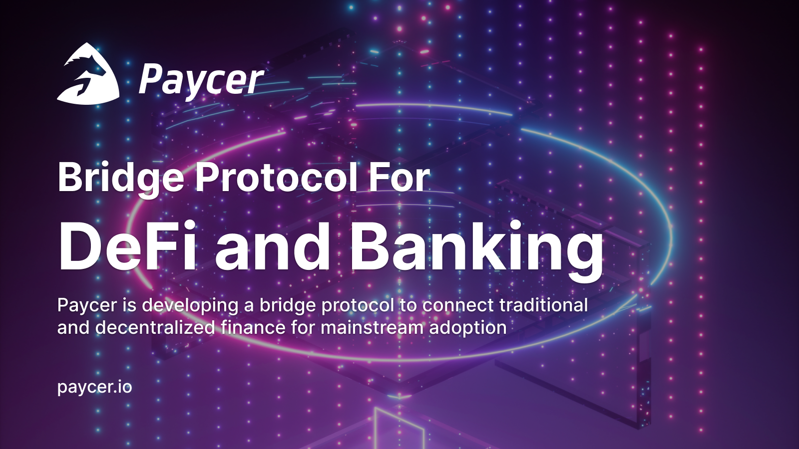

# Introduction

Welcome! This central source of truth containing instructions and documentations for the Paycer Protocol. We also provide other useful resources related to Paycer.

### What is the Paycer Protocol?

The Paycer team is developing a bridge protocol that aggregates DeFi and crypto services cross-chain and combines them with traditional banking services to create new user-friendly financial products and services available on an easy to use platform. Behind the Paycer project stands an official German company with its head office in Hamburg. An essential target of Paycer is to operate the protocol and the platform legally and in compliance with the authorities.  
  
The Paycer protocol will provide interchain operability and aggregate certain DeFi products from different blockchains and ecosystems. On top of the Paycer protocol sits the Paycer platform that will combine the Paycer protocol with traditional financial services like a bank account and a debit card. Users will only need to make a fiat money deposit on the Paycer platform to get started, no interaction with cryptocurrencies or DeFi is required. Paycer will then automatically place the deposit in selected DeFi products, providing a high and constant interest rate as a passive income.

### Getting started



### Learn More

* [Visit the website](https://www.paycer.io)
* [Medium Blog](https://paycerprotocol.medium.com/)
* [GitHub Repository](https://github.com/paycer-protocol)

### Community

* [Twitter](https://twitter.com/paycerprotocol)
* [Discord](https://discord.gg/eEX7Utqj)
* [Telegram Community](https://t.me/paycerprotocol)
* [Telegram Announcement](https://t.me/paycerprotocolanno)
* [LinkedIn](https://www.linkedin.com/company/paycer/)
* [Instagram](https://www.instagram.com/paycer_protocol/)

