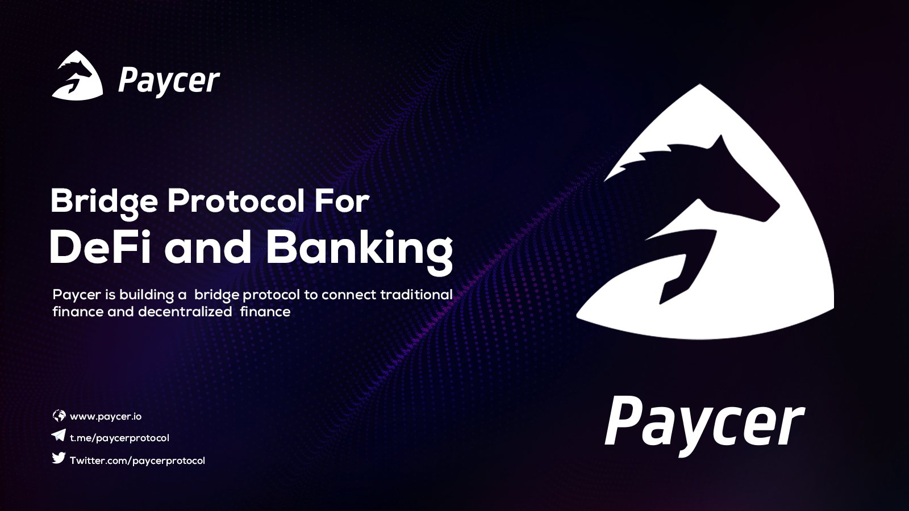

# Introduction

Welcome! This central source of truth contains instructions and documentation for using the Paycer Protocol. We also provide useful resources related to Paycer.

### What is Paycer Protocol?

The Paycer team is developing a bridge protocol that aggregates DeFi and crypto services cross-chain and combines them with traditional banking services to create new user-friendly financial products and services available on an easy to use platform.  
  
The Paycer protocol will provide interchain operability and aggregate certain DeFi products from different blockchains. On top of the Paycer protocol sits the Paycer platform that combines the Paycer protocol with traditional financial services like a bank account and a debit card. Users only need to make a fiat money deposit on the Paycer platform to get started, no interaction with cryptocurrencies or DeFi is required. Paycer will then automatically place the deposit in selected DeFi products, providing a high and constant interest rate as a passive income.

### Getting started



### Learn More

* [Visit the website](https://www.paycer.io)
* [Medium Blog](https://paycerprotocol.medium.com/)
* [GitHub Repository](https://github.com/paycer-protocol)

### Community

* [Twitter](https://twitter.com/paycerprotocol)
* Discord
* [Telegram Community](https://t.me/paycerprotocol)
* [Telegram Announcement](https://t.me/paycerprotocolanno)
* [LinkedIn](https://www.linkedin.com/company/paycer/)
* [Instagram](https://www.instagram.com/paycer_protocol/)

\`\`

