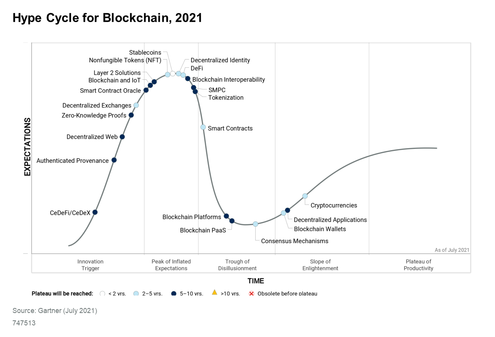

# 1. Introduction

In the following sections, the basic goals and functions of the Paycer protocol and platform are discussed; important terms are explained, and the Paycer project is placed in the blockchain technology landscape.

## **1.1 Abstract**

Paycer is building a bridge protocol to connect traditional and decentralized finance. This will support the mass market adoption of decentralized finance \(DeFi\) to fix the broken low interest banking system. In the past, depositing money in a bank constituted an attractive, easy, and secure investment that helped to increase personal wealth. But the zero-interest rate policy and increase in the money supply by the central banks has resulted in no interest earnings, while the value of money decreases year after year. The Covid crisis has made this issue even worse. The U.S. inflation rate, for example, is at a 13-year high \[1\]. In Germany, the inflation rate for July 2021 alone was around 3.8% \[2\]. This has led to a large segment of people losing part of their wealth every year. People need financial products that are as simple as putting money into a bank account while still earning high interest rates. It is Paycer's mission to provide precisely such simple and secure financial products for everyone based on blockchain technology. Therefore, Paycer is developing the Paycer protocol that aggregates DeFi products and provides them as new combined products on the Paycer platform. This will enable everyone to use the benefits of DeFi and create passive incomes to increase personal wealth. The following Figure 1 displays how Paycer is to be positioned in the blockchain and finance area.

## **1.2 Background**

For a better understanding of the services that Paycer will provide, a few terms must be defined. The following section therefore takes a closer look at the topics of blockchain, cryptocurrencies, smart contracts, and DeFi.

### **1.2.1 What is a Blockchain?**

A blockchain is a decentralized and immutable ledger in which multiple copies of the data are stored on many different blockchain nodes, which decide through a consensus mechanism which transactions are valid. For public blockchains, there is no central authority controlling the blockchain networks; these are in most cases managed by proof-of-work \(PoW\) or proof-of-stake \(PoS\) mechanisms. For PoW, a node must invest computing power to get the chance to validate the next block. For PoS, each node needs to deposit collateral to collaborate on the blockchain. In PoS, the block-creating node is chosen at random, often according to the distribution of the number of tokens staked by the participating nodes, while other nodes validate the transactions that are added by the block-creating node. This kind of consensus algorithm is applied for example in Cardano and will be applied in Ethereum 2.0. What are the advantages of PoW vs. PoS? PoW is a battle-tested system that has proven to be quite safe and reliant in the case of Bitcoin. However, there are some advantages of PoS over PoW. PoS is very energy efficient; for instance, Ethereum 2.0 with PoS consumes only 1% of the energy that the PoW-based Ethereum 1.0 consumes. Furthermore, a blockchain based on PoS tends to be more decentralized and faster than a blockchain based on PoW, and it has a lower entry barrier. Staking requires neither an expensive and specialized mining rig nor extra-low electricity costs.

From a mathematical point of view, blockchain technology is based on the fact that for a hash function and a given output value it is practically impossible to find an input value with . For a given value it is also practically impossible to find a value with so that . Another crucial part of blockchain technology is asymmetric encryption, which is based on the math of the algebraic structure of elliptic curves over finite fields in combination with the elliptic curve discrete logarithm problem. This is assumed to be computationally unfeasible for large keys but could theoretically be broken by a powerful quantum computer, which is not yet available. Most public blockchains also have their own cryptocurrency that can be used for payments or as a store of value. The transactions and ownership of a cryptocurrency are stored decentrally on the blockchain.

### **1.2.2 What is Cryptocurrency?**

Cryptocurrency is a digital currency in which transactions are verified and recorded by a decentralized system secured by cryptography. No centralized authority is needed to issue or maintain the currency. The most prominent cryptocurrency is Bitcoin, which was launched in January 2009. Cryptocurrencies such as Bitcoin provide a solution for storing value and personal wealth beyond restriction and confiscation. Because cryptocurrencies do not rely on banks, their disruptive potential in the finance sector is tremendous.

### **1.2.3 What are Smart Contracts?**

Smart contracts are small chunks of program code saved on the blockchain. The smart contracts are executed decentrally on different blockchain nodes. Hence, no single entity has control over the smart contract once it is deployed on the blockchain. However, nothing is free; that is why a fee is paid to the blockchain network for the execution of certain operations of the smart contract. This also prevents the issue of smart contracts running in an infinite loop. Smart contracts are the key technology to develop and operate DeFi platforms.

### **1.2.4 What is DeFi?**

The term DeFi was invented in 2018. The first projects to be deemed as DeFi were MakerDAO, Compound, and Uniswap. Since then, many more DeFi services and projects have entered the market \[3\]. DeFi has become a collective term for financial services and products not managed by a central institution but by rules written in program code executed decentrally. Nevertheless, most DeFi products are offered and developed by companies or other organizations. However, with most of the products, the user can always control and access his investments without any assistance from the organizations. DeFi is a new kind of financial technology and is still under development. At the moment, it is possible to achieve high interest rates with DeFi to generate a passive income. This is also due to the fact that the DeFi protocols distribute a large part of the generated user fees to investors. Most DeFi projects also offer their own token; for example, if a person provides liquidity or stakes their token, additional passive income can be created. Since DeFi is a new technology, it can be assumed that the current development state and the available platforms are only the tip of the iceberg. The DeFi market can be seen as a second decentralized banking and finance system that can disrupt the current centralized finance sector in ways that cannot yet be estimated. The clear benefit of DeFi is that small and agile teams can create solutions that scale very well, and they don’t have to pay for an entire workforce, branch offices, and a board of directors as does a bank. That is one reason that DeFi protocols can operate at lower costs and provide more returns for the users and investors. In the future, DeFi could make finance and banking a fair place for almost everyone. However, it can be assumed that both financial systems will coexist for a very long time.

## **1.3 The Problem Paycer is Solving**

Today, many people are losing their wealth because they do not have the knowledge or the will to invest their money properly. Not long ago, it was possible to get around 5% or more interest on personal savings from a bank. Times have changed, and there is a great deal of money stored in bank accounts without earning interest and even costing additional fees. In Germany, most banks have begun to charge penalty interest of 0.5% per year for deposits above 50k EUR\[4\]. The investor does not earn any return on capital; they lose part of the value to inflation and still have to pay a fee to the bank. Still, relatively few people have invested in cryptocurrencies, and even fewer have invested in DeFi or know of its existence. Cryptocurrencies are a countermovement in reaction to fiat money, which can be distributed by central banks in endless quantities. This is exactly why Satoshi Nakamoto invented Bitcoin shortly after the financial crisis of 2008. Entering the crypto market has become much easier in recent years, but this also leads to situations in which inexperienced users can easily lose their money. The DeFi market is changing and adapting quickly, and it is quite difficult for inexperienced users to enter it. For the majority of people, dealing with new technologies is a significant challenge anyway. Third parties are still needed to provide support and an additional security layer, especially for novice users.

## **1.4 Proposed Solution**

Paycer will offer a financial service allowing anyone to earn a passive income. Therefore, there are two main components: the Paycer protocol and the Paycer platform. The Paycer protocol is a mostly smart-contract-based protocol that aggregates DeFi protocols cross chain to create new investment products. Experienced crypto users can interact directly with the Paycer protocol to receive high and stable interest rates. However, the main purpose of the Paycer product remains to provide high interest rates to inexperienced mainstream users. The Paycer platform will offer simple user interfaces and processes that hide all the DeFi complexity. This should allow everyone to generate a passive income in the DeFi domain. The starting point in using the Paycer platform is fiat money; this will lower the barriers for new investors.

## **1.5 Why Paycer?**

The Paycer protocol and platform will be developed in Germany and will be fully regulated. Behind Paycer stands a strong team with many years of IT and blockchain experience, and they have already successfully completed many IT projects. The Paycer team has the drive, commitment, and expertise to make the Paycer project a success story. In addition, Paycer will offer a product that can help restore equity and financial independence. The Paycer platform will enable regular citizens to generate passive income and increase their wealth in the long run. Interest-free money deposited in banks is a large market that Paycer will address, and therefore Paycer has a tremendous growth potential. The Paycer team plans to build a successful long-term business providing smart blockchain-based financial products to mainstream end customers. The products offered will be continuously developed and will utilize current state-of-the-art DeFi and blockchain technology. Paycer will issue a utility token that provides various functions and benefits within the Paycer platform, including voting rights. These benefits—loyalty tiers, staking rewards, token buyback, and platform incentives—will help to build a functioning and thriving Paycer token economy. According to Gartner's current hype cycle for blockchain \(Figure 2\), DeFi is at the peak of its trend and will take another two-to-five years to reach true market maturity. Gartner describes CeDeFi as another important emerging innovation and predicts huge potential. This is because DeFi products are not easy to use; they lack regulation and legal security as well as customer support. The majority of centralized organizations, including legacy banks, do not understand the technology and processes behind blockchain-based DeFi and decentralized applications. According to Gartner, CeDeFi platforms can therefore create significant added value by combining the best of the old financial system with DeFi to develop new, regulated financial services. Paycer will position itself precisely in this emerging CeDeFi field and will thus be able to serve this emerging trend early on, thereby possibly gaining a strong position in the market.

\_\_

