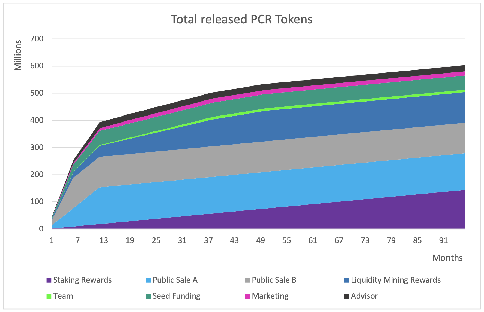
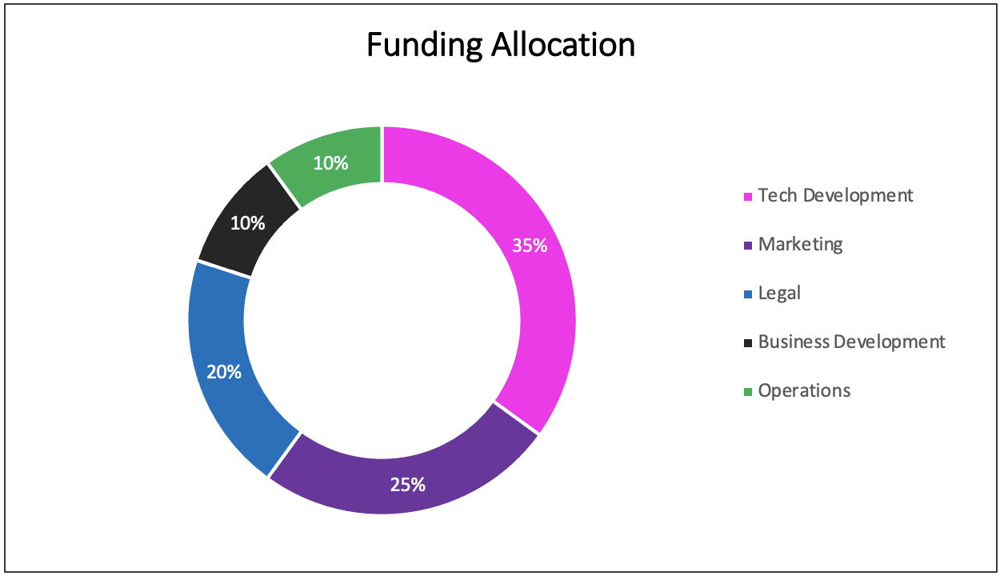

# 5. Token Economy

This chapter describes the details of the Paycer token \(PCR\). Various topics are covered such as token distribution and the properties of the utility token. Since the token economy is a very important topic for most investors, the respective metrics and mechanics are discussed in detail.

## **5.1 Token Distribution**

The Paycer team is trying to achieve a very large distribution of PCR tokens over many people so that whales cannot exert a great influence on the tokens and drop the price. The largest share of PCR tokens will be distributed over the community and private investors. There will be 750M PCR tokens in total, but at the beginning, many tokens will still be locked. A considerable 35% of the tokens will not be available at the beginning and will be distributed steadily through staking rewards and liquidity mining within several years. In Figure 8, the expected token release schedule over 96 months is displayed. After 12 months, all token sales and advisor tokens will be released. The PCR token supply is expected to reach around 400M tokens one year after the token sale, when all vesting phases are over. This number includes additional tokens from staking rewards and liquidity mining that will also enter the market, which will depend on the number of tokens being staked and the participation in liquidity mining. As displayed in Figure 8, after one year, most of the released PCR tokens will come from staking and liquidity mining. The total maximum of 750M PCR tokens could be reached theoretically eight years after the token sale. However, this could only happen if Paycer sells all tokens that are still owned by the company. The expected number of released tokens after eight years is around 600M. If all 750M PCR tokens are distributed, there will be no additional inflation for the tokens since the maximum supply is fixed. Since Paycer will also buy back PCR tokens, the freely available supply could be less than 600M.

The circulating token supply at time $$T$$ \(for $$T>0$$\) can be obtained by

$$
S_T=S_0 \prod_{t=0}^{t-1}(1+g_t)
$$

where $$t$$ is the time \(in years\) elapsed since the token sale, $$S_t$$ is the total token supply at time $$t$$,$$S_0$$ is the number of tokens minted at time of IDO and $$g_t:=\frac{S_{t+1}-S_t}{S_t}$$ is the growth rate of $$S_t$$ between times $$t$$ and $$t+1$$.

### 5.1.1 Seed Funding

For the seed funding, 7% of the PCR tokens will be allocated; this is necessary to cover further costs incurred for the main token sale such as legal costs, marketing, listing costs, and costs for the further development of our prototype. The tokens sold during the seed funding phase will have a small discount compared to the later token sale stages. In addition, the current crypto market situation makes it necessary to raise more seed funding as the sentiment among private investors might decline. The PCR tokens sold in the seed-funding phase will come with a discount compared to public sale. The purchased tokens will come with a vesting period of 12 months, during which 1/365 of the purchased tokens will be released daily. The amount that a single investor can buy will be limited.

### 5.1.2 Public Sale A

In public sale A, 18% of the Paycer tokens will be offered to investors. Tokens bought in sale A will come with a vesting period of 12 months, during which 1/365 of the purchased tokens will be released daily. The amount that a single investor can buy will be limited.

### 5.1.3 Public Sale B

In public sale B, 15% of the Paycer tokens will be offered to investors. Tokens purchased in sale B will come with a vesting period of six months, during which 1/180 of the purchased tokens will be released monthly. The amount that a single investor can buy will be limited.

### 5.1.4 Liquidity Pools

In order to obtain more liquidity to run the Paycer platform and to implement internal swaps in the backend, Paycer will open liquidity pools. Investors will be able to provide liquidity to these pools to earn PCR tokens. The total number of Paycer tokens that will be allocated to the liquidity pools will be 112.5M, 15% of the total tokens. The PCR tokens will be released over a period of 50 months.

### 5.1.5 Community Incentives – Staking Rewards

Twenty percent \(150M\) of the total PCR tokens will be reserved for staking rewards. These tokens will be distributed over a long period of time. This is, on the one hand, to keep the inflation of the PCR tokens low and to stabilize the price. On the other hand, it offers the holders of PCR tokens long-term value and a good investment. The staking rewards will last for eight years even without the rebuy mechanism. The rebuy mechanism will refill the staking rewards pool and thereby increase the duration to as long as the Paycer protocol and the platform are actively used.

### 5.1.6 Team Token

Ten percent \(75M\) of the PCR tokens will be reserved for the team. However, this does not mean that the team will freely use these tokens. Each team member will receive 750,000 tokens, which will be distributed in six installments of 125,000 tokens over a period of three years. This should prevent the team from having a negative effect on the token price and motivate the team members in the long term, thus ensuring the success of Paycer. Therefore, almost 90% of the team tokens will remain unused for the moment and will be partly distributed to new team members or used for one-time bonus payments when very important milestones are reached in the next few years. In this case, the current price of the PCR token is also taken into account, and in the future, only smaller quantities of tokens will be distributed when PCR is at a higher price. The Paycer team will be careful not to destabilize the PCR token price itself, and if team members sell tokens, it will only be done in very small quantities.

### 5.1.7 Emergency Fund

For the emergency fund, 5% of the tokens will be provided; these tokens can only be used in emergencies, for example if a large quantity of PCR tokens were to be lost for some reason or if Paycer had to sell some tokens to cover costs. Even if these tokens exist, in the best case, they will never be used.

### 5.1.8 Marketing Token

Of the tokens, 4% will be used for marketing purposes; this can be a sole marketing method or combined with other marketing tools. For example, tokens can be offered for specific activities and actions of individuals from the community.

### 5.1.9 Advisor and Partner Tokens

These reserved tokens will be distributed to advisors and partners; 3% of the tokens will be allocated for this purpose. These tokens are intended to provide advisors and partners with an incentive to accompany and actively support Paycer on its path to success because only if Paycer is successful in the long term will they experience a good increase in value.

### 5.1.10 Legal Token

Three percent of the PCR token will be reserved for legal aspects. These tokens can be used to raise additional money for legal matters through sale. The expenses for specialist lawyers can quickly become high; 400 EUR and more per hour is not uncommon. Therefore, a buffer is formed here in order to have additional money available in the future for lawyers and legal costs.

## **5.2 Use of Funds**

The capital collected from seed funding, public sale A, and public sale B will be used for the further development of the Paycer company and all related operations. The largest part of the investment will be allocated to technical development, including the Paycer protocol and platform. Another important point will be marketing and all related activities to reach end customers. Legal and regulatory aspects are also crucial, for instance obtaining a banking license. Continuous business development and exploration of new business areas are also essential. The last major item is operations; this includes infrastructure costs, rent, office equipment, and salaries that do not relate to any of the previously mentioned areas. The precise allocation of the funds is displayed in Figure 9.

## **5.3 Staking**

For participating in staking, that is holding PCR in the Paycer wallet, users are rewarded with an interest rate in PCRs as a staking reward. The interest rate depends on the loyalty tier of the user. Interest rates will start at a high level and then slowly decline over the years so that staking rewards can be distributed over a long period of time. This is because Paycer aims to build a long-term enterprise, business model, and token economy. If the interest rates do not drop over time, the compound interest effect will lead to no further rewards being paid out after only a few years. Paycer intends to ensure a long-term distribution of tokens over a period of around eight years or longer without a buyback mechanism. The token buyback mechanism will also help ensure that the pool of reward tokens is constantly replenished with additional tokens and that staking rewards can be granted for even longer. The staking rewards will be distributed daily and can be claimed once a week. Due to the potential weekly re-stake of these additional PCR tokens, the interest rate can be additionally increased by compound interest over the years. The number of Paycer tokens $$N_T$$ after $$T$$ years assuming a variable rate of compound interest $$APY_t$$ in year $$t$$ can be described as follows:

$$
N_T=N_0 \prod_{t=1}^T \left(1+ \frac{APY_t}{100} \right)
$$

The nominal rate for the staking rewards consists of a baseline rate , which varies over the years, multiplied by the tier factor \(1.25, 1.50, 1.75, and 2.0 for associate, senior, manager and partner tiers, respectively\).

The baseline for interval without the use of token buyback can be derived from the following equation:

$$
T_n^{CI}=\sum_{i \in \{A,S,M,P\}} E_n[T_t^{supply} p_t^{staked} p_t^i]\frac{t_n-t_{n-1}}{365}b_nr^i
$$

where

* $$n$$ refers to the time interval $$t \in [t_n, t_{n+1})$$, where $$t_n$$ is the number of days since IDO,
* $$T_n^{CI}$$ is the number of \(community incentive\) tokens distributed by means of rewards,
* $$E_n(X)$$ is the expected value of $$X$$ for time interval $$n$$,
* $$T_t^{supply}$$ is the total token supply at time $$t$$,
* $$p_t^{staked}$$ is the fraction of the total token supply that is staked at time $$t$$,
* $$p_t^i$$ is the fraction of the staked tokens that are staked in tier $$i \in \{A, S, M, P\}$$ in time $$t$$, 
* $$b_n$$ is the baseline rate for period $$n$$ and
* $$r^i$$ is the tier factor for tier $$i \in \{A, S, M, P\}$$.

In an easy transformation, the baseline $$b_n$$ for time interval $$n$$ can be derived as

$$
b_n = \frac{ 365 \cdot T_n^{CI} }{ (t_n - t_{n-1}) \cdot E_n\left[T^{supply}_t p_t^{staked} \right] \cdot  \sum \limits_{ i \in \{A, S, M, P\} }{ E_n\left[p_t^i \right] r^i } }
$$

Since $$T_t^{supply}$$ is deterministic \(linearly increasing during the first years\), $$E_n\left[T_t^{supply}\right]$$ is deterministic as well and can be expressed as

$$
E_n\left[T_t^{supply}\right]= \overline{T_n^{supply}} = \frac{\sum_{i=t_n}^{t_{n-1}} T_i^{supply}}{\sum_{i=t_n}^{t_{n-1}} I_{\{\Delta T_i^{supply} \ne 0\}}}
$$

The values for $$E_n \left[p_t^{staked} \right]$$ and $$E_n \left[ p_t^i \right]$$ are estimated by tracking and exponentially smoothing with

$$
\begin{align*}
s_t=0.1x_t+0.9s_{t-1}, \quad \text{for }t>0 \\ 
s_t = x_t, \quad \text{for }t=0
\end{align*}
$$

where $$s_t$$ and $$x_t$$ are the respective smoothened and new values.

The baseline is adjusted every six months. During the first six months after the IDO, the base rate will start at 12%. This means that during this time, investors with at least 100,000 PCR tokens \(partner tier\) will receive 2 ⋅ 12% = 24% as their nominal staking reward rate.

## **5.4 Liquidity Mining**

To ensure sufficient liquidity for internal swaps and crypto lending, Paycer will open its own liquidity pools. Liquidity providers will be rewarded in two ways: They will earn fees for every trade, and they will receive PCR tokens.

The fee for trading a token pair amounts to 0.2%. This fee is calculated on the selling end of a traded token pair, and the accumulated fees are added as liquidity to the respective token pool. The liquidity providers profit from this rise in the liquidity pool when they withdraw their provided liquidity plus their share of the accrued fees.

The PCR tokens will be distributed to the liquidity providers as a further reward. Fifteen percent of the maximum supply of PCR tokens is reserved for liquidity mining, which results in 75,000 PCR tokens being distributed daily over a period of 50 months. The total distributed PCR token reward to user _k_ per day can be calculated as

$$
T_k^{PCR} = \frac{75,000 \text{ PCR}}{N} \cdot \sum_{i=1}^N \frac{\# \{LP_i^k\}}{\# \{LP_i^{total}\}}
$$

where

* $$N$$ is the number of liquidity pools on the Paycer platform,
* $$\# \{LP_i^{total}\}$$ is the total number of liquidity pool tokens for pool $$i$$, and
* $$\# \{LP_i^k\}$$ is the number of liquidity tokens for pool $$i$$ owned by user $$k$$.

Since the distributable number of PCR tokens is equal for every liquidity pool, the token reward is higher in smaller pools compared to larger pools. This functions as an incentive for users to provide more liquidity in those pools with less liquidity \(but higher token returns\).

As another consequence, relatively high rewards are distributed at the beginning when the pools are new, while the rewards slowly decrease as more people provide liquidity. This decrease in token rewards should be compensated by the increasing transaction volume and thus the higher amount of distributed fees to the liquidity providers.

During the 50-month period of token distribution for liquidity mining, Paycer will monitor the necessity of increasing these token rewards.

## **5.5 Buyback**

Paycer plans to use a part of its revenue to buy back Paycer tokens, which would reduce the circulating supply. Although plans for a token buyback through Paycer are very solid, this may be subject to legal roadblocks and approvals that may result in restrictions or delays. The more revenue and profit the Paycer platform would generate, the more tokens could be bought back. The PCR tokens received through the buyback will then be used to replenish the staking reserve. This procedure should allow the distribution of staking rewards over a very long period of time.

The customer will choose which fraction of her or his balance on the Paycer platform she or he wants to be invested in DeFi products \($$A_t^{invested}$$\), staked \($$A_t^{staked}$$\), or paused \($$A_t^{paused}$$\). The returns on the investment in DeFi products will be used by Paycer in the following way:

* 90% for the customer,
* 5% for Paycer to pay the team and for further investments, and
* 5% to rebuy PCR tokens.

Please note that $$A_t^{invested}+A_t^{staked}+A_t^{paused}=1$$.

The customer will be incentivized to distribute her/his balance on the Paycer platform so that the expected return will be maximized considering her/his risk profile.

Scenario 1: Times are rough, and crypto seems to be bearish for a while. The customer will tend to pause the balance, which leads to

$$
A_t^{paused} >> A_t^{invested} + A_t^{staked}
$$

Scenario 2: Investments in DeFi products have high returns, and the staking rewards are considerably lower. The customer will prefer to invest the balance in DeFi versus pausing the balance and earning no interest or staking the balance:

$$
A_t^{invested} >>  A_t^{staked} + A_t^{paused}
$$

Scenario 3: The staking rewards are high for the customer’s loyalty class compared to the investment returns. The customer will prefer to stake the balance versus investing or pausing it:

$$
A_t^{staked} >> A_t^{invested} + A_t^{paused}
$$

For a given moment in time, the return from DeFi investments is considered relatively stable. Then, the degrees of freedom are as follows:

* The fraction of the supply that is staked
* The fraction of the supply that is invested
* The market price of a token
* The return for staking
* The return for investing

These variables are intertwined and expected to find equilibrium.

The market price should be in sync with the return from investing in the DeFi project. If there is a high return, more value will be pulled into this investment, which will result in a higher budget for PCR token buybacks and thus a higher staking reward. This will increase demand for PCR tokens and thus increase the price.

The following control circuits can be considered:

Case 1: _The market price of a PCR token is relatively low._ This means that in the buyback, many tokens can be acquired, which increases the return for staking. This increases the incentive to buy and stake PCR tokens, which increases the demand and consequently the market price of the PCR token.

Case 2: _The market price of a PCR token is relatively high._ Buyback will be limited to fewer tokens, which lowers the staking reward. This makes the PCR token less attractive, and thus its market value should decrease.

Case 3: _The customers on average tend to be strongly biased towards staking. Since the number of newly minted tokens for community incentives per month is constant while the total token supply increases,_ the staking return will decrease as well. This means that more rewards will be paid from the PCR tokens that are bought back by Paycer. In return, those tokens are bought from the 5% that Paycer keeps from the return of the invested balance. If the invested balance is low, Paycer will have lower resources to buy back PCR tokens, and it will thus have fewer tokens to redistribute. When the staking rewards drops, customers will tend to spend more of their account balance for Defi investment instead of staking.

Case 4: If, however, only a few customers are staking, and they rather tend to invest large fractions of their balance in DeFi, the total invested amount will be high, and thus the 5% of this amount that is used by Paycer for rebuy will be high as well. More tokens can be bought back and redistributed as rewards. At the same time, this higher number of tokens will be redistributed to fewer \(staking\) tokens, which will yield higher staking rewards. This incentivizes customers to use a larger fraction of their account balance for staking.

Note that changes can still occur regarding the buyback mechanism when operating the platform in cases such as follows:

* Users are not getting enough yields, and more percentage should go to them.
* The costs for operating the Paycer platform are not fully covered.
* Paycer needs to buy back more PCR tokens to distribute staking rewards.

## **5.6 Loyalty Tiers**

The Paycer token is a utility token that allows users to be divided into certain loyalty tier groups. There will be four loyalty tiers at the launch of the Paycer platform. The various tiers will offer benefits on the Paycer platform. The lowest tier is the associate level, which is reached with at least 5,000 PCR tokens in the Paycer wallet. The next highest tier is the senior level, which is reached with at least 15,000 PCR tokens in the wallet. The manager tier is reached with 35,000 tokens in the Paycer wallet. The highest loyalty tier is the partner level, which is achieved with 100,000 PCR tokens in the user's Paycer wallet and offers the greatest benefits.

The following table provides an overview of the various loyalty tiers and the benefits they offer on the platform.

|  | Associate | Senior | Manager | Partner |
| :--- | :--- | :--- | :--- | :--- |
| Staking Rewards | Base Rate ⋅ 1.25 | Base Rate ⋅ 1.50 | Base Rate ⋅ 1.75 | Base Rate ⋅ 2.0 |
| Earn More Interest | Interest Rate + 1.5% | Interest Rate + 2.5% | Interest Rate + 3.5% | Interest Rate + 4.5% |
| Loan Fee Discount | Loan Fees - 7.5% | Loan Fees - 12.5% | Loan Fees - 15% | Loan Fees - 20% |

Table 1 Loyalty Tier details

### 5.6.1 Additional Staking Rewards

The different loyalty tiers will offer increased reward rates for the staking of PCR tokens. The reward rate is calculated as follows: The number of PCR tokens in the user's wallet determines which loyalty tier applies to that user. The current base rate for the staking of PCR tokens is then multiplied by the factor of the respective loyalty tier to obtain the final reward rate for the user.

The reward multiplicators will be as follows:

Associate: 1.25  
Senior: 1.5  
Manager: 1.75  
Partner: 2

The tier reward $$r_t^i$$ in year $$t$$ for tier $$i$$ is consequently derived as $$r_t^i=r_t^{base} \cdot r^i$$.

When user Bob holds, for example, 21,050 PCR tokens in his wallet, he will be assigned to senior level status. If the base rate is currently 10% for staking rewards, the rate is multiplied by the senior level factor of 1.5, and Bob receives 15% as the final reward rate.

### 5.6.2 Additional Interest

The loyalty tiers will also offer a benefit regarding interest rates for invested money. The respective loyalty tiers will receive an additional premium on the current interest rate.

The additional interest in percentage points per tier will be as follows:

Associate: 1.5%  
Senior: 2.5%  
Manager: 3.5%  
Partner: 4.5%

The adjusted interest rate $$r_i$$ per tier $$i$$ can be derived as $$r_i=r_b + a_i$$, where $$r_b$$ is the current interest rate and $$a_i$$is the benefit in percentage points within the loyalty tier $$i$$.

When, for example, user Bob holds 100,950 PCR tokens in his wallet, he will be assigned to partner level status. If the interest rate for investing fiat money is currently at 9%, the loyalty tier rate of 4.5% will be added to the current rate, and Bob will then receive 13.5% on his deposits.

### 5.6.3 Loan Fee Discount

Loyalty tiers will also offer a benefit when  cryptos are leant out on the Paycer platform. The respective loyalty tiers will receive an additional discount on the current lending rates.

The discount per loyalty tier on loan fees will be as follows:

Associate: 7.5%  
Senior: 12.5%  
Manager: 15%  
Partner: 20%

The discounted lending rate $$r_i$$ per tier $$i$$ can be calculated by $$r_i=r_b -d_i r_b=r_b(1-d_i)$$, where $$r_b$$ is the current loan rate and $$d_i$$ is the discount within the loyalty tier $$i$$.

When user Bob holds, for example, 81,150 PCR tokens in his wallet, he will be assigned to manager level status. If the base fee rate for lending fiat money or cryptos is currently at 9%, the loyalty tier level discount of 15% will be deducted. That means that Bob will pay a rate of 7.65% for his loans.

## **5.7 Voting**

The Paycer token will have some features of a governance token that will allow token holders to influence the further development of the Paycer platform through voting \[12\]. The weight of each vote depends on the number of the user’s PCR tokens compared to the total number of PCR tokens in Paycer wallets. 

With $$N_k$$ being the average number of PCR tokens in wallet $$k$$ during the last seven days, the voting weight $$w_i$$ for wallet $$i$$ can be determined as

$$
w_i=\frac{N_i}{\sum_k N_k}
$$

