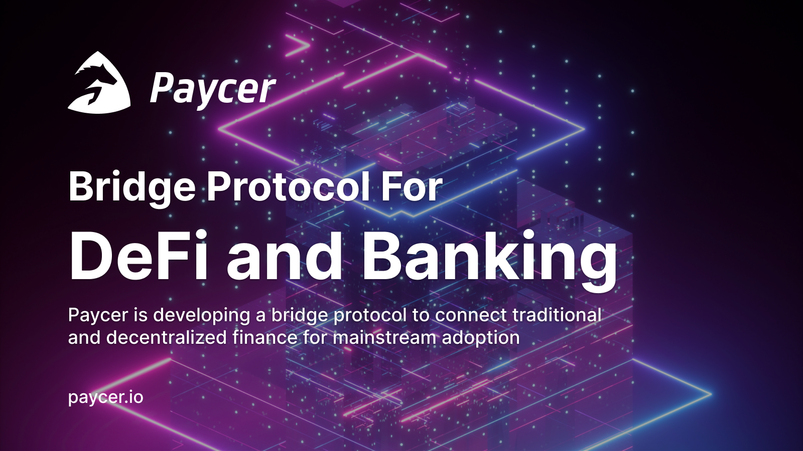

# 📘 Whitepaper

**Building a cross-chain yield aggregation bridge protocol for DeFi and banking for mainstream adaption**

This whitepaper presents the Paycer® protocol and platform, a cross-chain yield aggregator protocol.&#x20;

The main goals of Paycer are as follows:

1. &#x20;Provide high, stable, and secure interest rates for users;
2. &#x20;Develop smart and innovative financial services;
3. &#x20;Offer easy-to-use UIs and processes that empower everyone to use the Paycer services;
4. &#x20;Bring DeFi to mainstream users to address a huge market;
5. &#x20;Fix the broken zero-interest banking system; and
6. &#x20;Build a long-lasting company that will establish itself as an important partner in the financial system.

This whitepaper aims to provide the reader with a basic overview of the blockchain and DeFi technology, followed by a deep dive into various aspects of the Paycer project. The topics covered include technical and architectural aspects, the Paycer protocol and platform, token economics, the business model, the go-to market strategy, the team, the vision, and compliance. requirements. This whitepaper will be updated as our work and the community evolve throughout the project.
