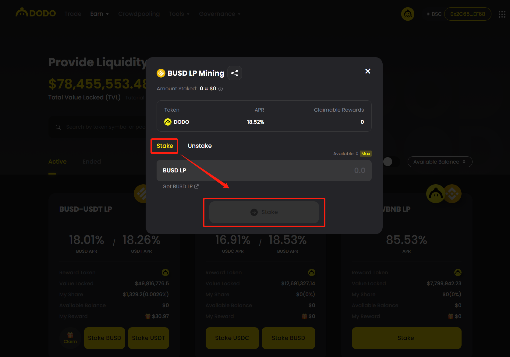

# Dodo Liquidity Mining

### What is DODO?

DODO is a decentralized exchange platform powered by the Proactive Market Maker (PMM) algorithm. It features highly capital-efficient liquidity pools that support single-token provision, reduce impermanent loss, and minimize slippage for traders. The trading platform also offers SmartTrade, a decentralized liquidity aggregation service that routes to and compares various liquidity sources to quote the optimal swap rate between any two tokens. In addition, DODO removed all roadblocks hindering liquidity pool creation for the issuance of new assets - asset ratios, liquidity depths, fee rates, and other parameters can all be freely customized and configured in real-time. Based on this breakthrough, DODO has developed Crowdpooling, a permissionless, equal opportunity liquidity offering mechanic, as well as customizable technical solutions geared towards professional on-chain market makers.

Learn more: [https://dodoex.github.io/docs/docs/](https://dodoex.github.io/docs/docs/)

### What is a Community Pool?

The community liquidity mining pool on DODO is a pool where everyone from the community can provide PCR and USDC as liquidity to farm PCR rewards. At the start the rewards will be very high so it is good to be early. When more people are joining the pool the rewards will get less because they get split over more people. To join the liquidity mining you will need PCR and USDC tokens on Polygon network and a bit MATIC to pay the gas fees.

Please find the link to the PCR/USDC pool below. You can find more info on how to participate in the liquidity mining in the following sections on this page.


Link to the PCR/USDC Liquidity Mining Pool


### How to participate in Liquidity Mining on DODO?

**1. Go to**[ **https://app.dodoex.io/mining**](https://app.dodoex.io/mining)**. Alternatively, select “Mining” under the “Earn” tab.**

Or just follow this direct link to the PCR / USDC pool:

[https://app.dodoex.io/mining?network=polygon\&mining=0x5ecdc7727532d81c9a938e130d49f5beefafd38a](https://app.dodoex.io/mining?network=polygon\&mining=0x5ecdc7727532d81c9a938e130d49f5beefafd38a)

**2. Click on the “Connect Wallet” button in the upper right corner.**

Please make sure you have enough **MATIC** in your wallet to pay for network gas fees.

**3. Select a trading pair you wish to provide liquidity for to earn rewards.**

Go to Earn > Mining to check for trading pairs that are available for liquidity mining (PCR-USDC in this case)

**4. Add liquidity**

In the “Mining” page under the “Earn” drop-down menu, click the trading pair you wish to add liquidity. Then you will be redirected to the “Liquidity” page.

Click the “Add Liquidity” button. Enter the amount of tokens you wish to add to the pool. Approve the token permission first if prompted. You could start adding liquidity once the “approval to spend” is done. Note: DODO supports single-side liquidity, you do not need to add both pairs if you do not wish to.

**5. Stake LP**

After adding liquidity and receiving DLP tokens, select a trading pair you wish to provide liquidity and click the “Stake” button. You will need to authorize it if you stake it for the first time.

The DLP token is the proof of DODO liquidity provider, representing the share of the liquidity pool. The ratio of DLP to the liquidity assets is not 1:1.

Send the transaction in your wallet, and the mining will start after the transaction is confirmed in the blockchain.

DODO's liquidity mining has no lock-up period and can be redeemed at any time. Rewards are accumulated per block.

To claim rewards, click the “Claim” button, confirm the transaction in your wallet pop-up. Once the transaction is approved, you receive DODO your mining rewards.

**6. Withdraw Liquidity**

The redemption process is the opposite of the staking process. You will need to unstake the DLP on the “Mining” page, then withdraw your pooled tokens on the “Liquidity” page.\

### Paycer PCR/USDC Pool

Please find the direct link to the PCR/USDC pool below.&#x20;


PCR - USDC Community Pool on DODO

