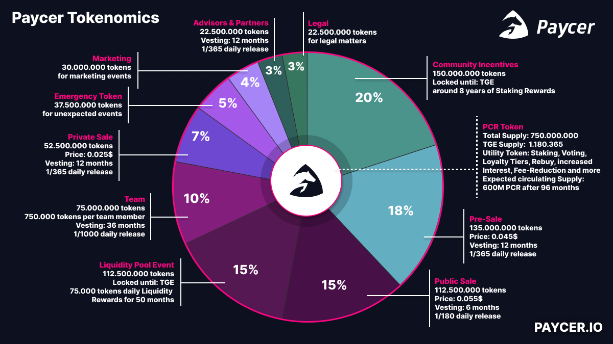
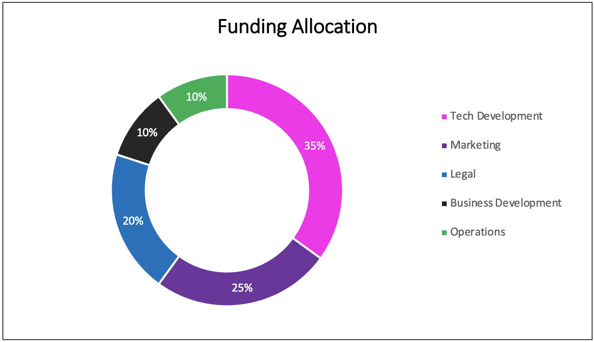

# Tokenomics

### 1. Paycer Token \(PCR\)

Token type: ERC20  
Use case: Utility Token  
Maximum Supply: 750.000.000  
TGE Supply: 1.180.365  
79% of PCR are allocated to the community and will be distributed by token sales, marketing, staking rewards and liquidity mining.

### 2. Private Sale

Tokens available for sale: 52.500.000 PCR  
Token price: $0.025  
Vesting period: 12 months with a daily release of 1/365 of bought PCR

Hardcap: $1.312.500,00

### 3. Pre-Sale

Tokens available for sale: 135.000.000 PCR  
Token price: $0.045  
Vesting period: 12 months with a daily release of 1/365 of bought PCR

Hardcap: $6.075.000,00

### 4. Public Sale

Tokens available for sale: 112.500.000 PCR  
Token price: $0.055  
Vesting period: 6 months with a daily release of 1/180 of ought PCR

Hardcap: $6.187.500,00

### 5. Team Token

Total team tokens: 75.000.000 PCR \(10%\)  
Each team member gets an allocation of 750.000 PCR.  
Vesting period of 36 months with a daily release of 1/1000 of allocated PCR.

The remaining PCR tokens remain in the team pool for new team members and as team reserve or can be used for a bonus when reaching important milestones.

### 6. Advisor and Partner Tokens

Total advisor and partner tokens: 22.500.000 PCR  
Vesting period: 12 months with a daily release of 1/365 of bought PCR

### 7. Expected Development of the Circulating PCR Supply

The expected circulating supply will be around 600M PCR 8 years after the TGE. One year after the TGE when most vesting periods are over, the main drivers for the token release will be PCR staking and liquidity mining.

### 8. Token Utilities

1. Voting
2. Staking
3. Loyalty Tiers
4. More interests
5. Reduced fees
6. More rewards
7. Token buyback

### 9. PCR Staking

TBD

### 10. Liquidity Mining

TBD

### 11. Token Buyback

TBD

### 12. Use of Funding

The capital collected from private sale, pre-sale, and public sale will be used for the further development of the Paycer company and all related operations. The largest part of the investment will be allocated to technical development, including the Paycer protocol and platform. Another important point will be marketing and all related activities to reach end customers. Legal and regulatory aspects are also crucial, for instance obtaining a banking license. Continuous business development and exploration of new business areas are also essential. The last major item is operations; this includes infrastructure costs, rent, office equipment, and salaries that do not relate to any of the previously mentioned areas. The precise allocation of the funds is displayed in the following figure.

