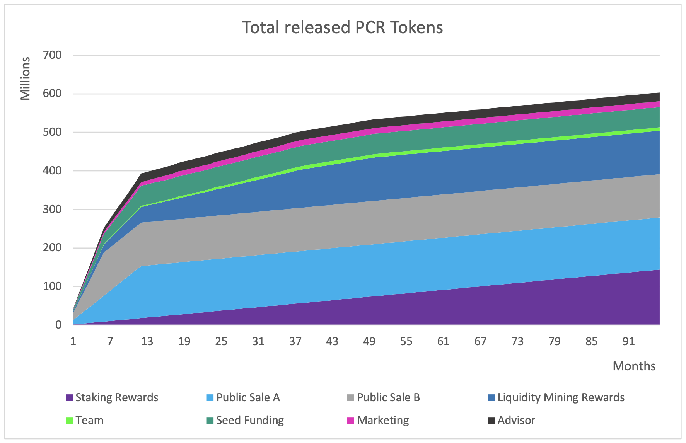

# Tokenomics

### 1. Paycer Token \(PCR\)

Token type: ERC20  
Use case: Utility Token  
Maximum Supply: 750.000.000  
TGE Supply: 1.180.365

### 

### 2. Private Sale

Tokens available for sale: 52.500.000 PCR  
Token price: $0.025  
Vesting period: 12 months with a daily release of 1/365 of bought PCR

Total possible raise: $1.312.500,00

### 3. Pre-Sale

Tokens available for sale: 135.000.000 PCR  
Token price: $0.045  
Vesting period: 12 months with a daily release of 1/365 of bought PCR

Total possible raise: $6.075.000,00

### 4. Public Sale

Tokens available for sale: 112.500.000 PCR  
Token price: $0.055  
Vesting period: 6 months with a daily release of 1/180 of ought PCR

Total possible raise: $6.187.500,00

### 5. Team Token

Total team tokens: 75.000.000 PCR \(10%\)  
Each team member gets an allocation of 750.000 PCR.  
Vesting period of 36 months with a daily release of 1/1000 of allocated PCR.

The remaining PCR tokens remain in the team pool for new team members and as team reserve or can be used for a bonus when reaching important milestones.

### 6. Advisor and Partner Tokens

Total advisor and partner tokens: 22.500.000 PCR  
Vesting period: 12 months with a daily release of 1/365 of bought PCR

### 7. Expected Development of the Circulating PCR Supply

The expected circulating supply will be around 600M PCR 8 years after the TGE. One year after the TGE when most vesting periods are over, the main drivers for the token release will be PCR staking and liquidity mining.

