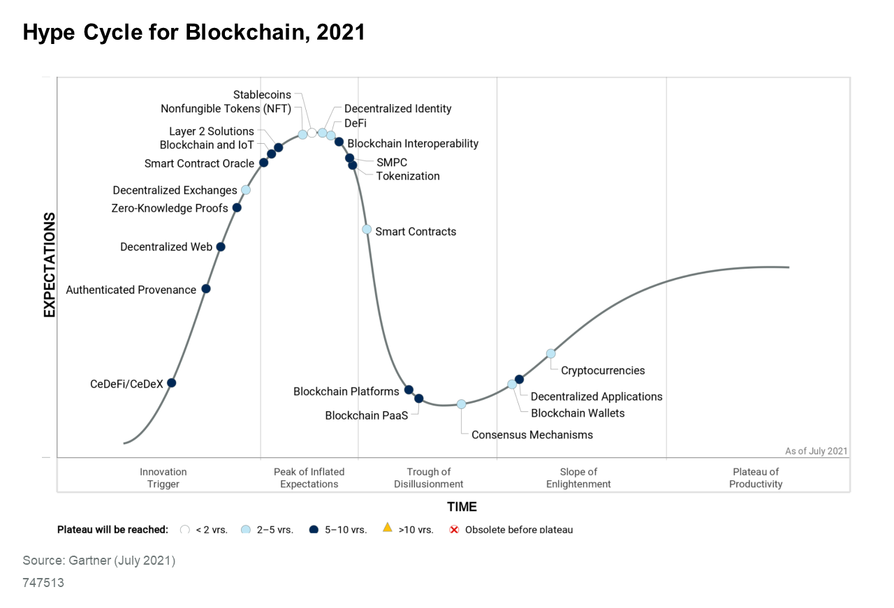

# Untitled

**WHITEPAPER**

**Building a cross-chain yield aggregation bridge protocol for DeFi and banking for mainstream adaption**

**VERSION 1.0.0 \| August 2021**

 **paycer.io**

**paycer.finance**

Copyright © Paycer 2021 – All Rights Reserved

Paycer Protocol Whitepaper

The Paycer Protocol Team

Version 1.0.0

August 2021

The Paycer Team is building a cross-chain yield aggregation **bridge protocol for DeFi and banking for mainstream adaption.**

This whitepaper presents the Paycer® protocol and platform, a cross-chain yield aggregator protocol. The main goals of Paycer are as follows:

1. Provide high, stable, and secure interest rates for users;
2. Develop smart and innovative financial services;
3. Offer easy-to-use UIs and processes that empower everyone to use the Paycer services;
4. Bring DeFi to mainstream users to address a huge market;
5. Fix the broken zero-interest banking system; and
6. Build a long-lasting company that will establish itself as an important partner in the financial system.

This whitepaper aims to provide the reader with a basic overview of the blockchain and DeFi technology, followed by a deep dive into various aspects of the Paycer project. The topics covered include technical and architectural aspects, the Paycer protocol and platform, token economics, the business model, the go-to market strategy, the team, the vision, and compliance. requirements. This whitepaper will be updated as our work and the community evolve throughout the project.

**Table of Contents**

[**1. Introduction**]() [**5**]()

[**1.1 Abstract**]() [5]()

[**1.2 Background**]() [6]()

[_1.2.1 What is a blockchain?_]() [_6_]()

[_1.2.2 What is a cryptocurrency?_]() [_6_]()

[_1.2.3 What are smart contracts?_]() [_6_]()

[_1.2.4 What is DeFi?_]() [_7_]()

[**1.3 The problem Paycer is solving**]() [7]()

[**1.4 Proposed solution**]() [7]()

[**1.5 Why Paycer?**]() [8]()

[**2. Paycer Protocol**]() [**8**]()

[**2.1 On-Chain Yield Aggregator**]() [9]()

[**2.2 Yield Aggregation Strategies**]() [10]()

[_2.2.1 Liquidity Mining_]() [_10_]()

[_2.2.2 Staking_]() [_10_]()

[_2.2.3 Lending_]() [_11_]()

[_2.2.4 Arbitrage_]() [_11_]()

[_2.2.5 Other DeFi Investments_]() [_12_]()

[**2.4 Automated Risk Mitigation**]() [12]()

[**2.5 Flash Loan Manipulation and Hack Prevention**]() [13]()

[**2.6 Avoiding High Transaction Fees**]() [13]()

[**2.8 Paycer Protocol Architecture**]() [13]()

[_2.8.1 Design Principles_]() [_13_]()

[_2.8.2 Technology Stack_]() [_14_]()

[_2.8.3 General Protocol Functionality_]() [_14_]()

[_2.8.4 Cross-chain and Interchain Operability_]() [_14_]()

[_2.8.5 Architecture Diagram_]() [_16_]()

[**3. Paycer Platform**]() [**17**]()

[**3.1 Main Features**]() [17]()

[_3.1.1 Bank Account_]() [_17_]()

[_3.1.2 Paycer Wallet_]() [_17_]()

[_3.1.3 Lending_]() [_17_]()

[_3.1.4 Earn Interest_]() [_17_]()

[_3.1.5 Easy DeFi_]() [_17_]()

[_3.1.6 DeFi-as-a-Service \(DFaaS\)_]() [_18_]()

[**3**]()[.]()[**2 Design Goals and Principles**]() [18]()

[**3.3 Paycer Platform Architecture**]() [18]()

[**3.3 Paycer Platform Architecture**]() [19]()

[**4 Paycer Prototype**]() [**20**]()

[**4.1 Portfolio Page**]() [20]()

[**4.2 Invest Page**]() [21]()

[**4.3 Staking Reward Page**]() [21]()

[**5 Paycer Token Economy**]() [**22**]()

[**5.1 Token Distribution**]() [22]()

[_5.1.1 Seed Funding_]() [_23_]()

[_5.1.2 Public Sale A_]() [_23_]()

[_5.1.3 Public Sale B_]() [_23_]()

[_5.1.4 Liquidity Pools_]() [_23_]()

[_5.1.5 Community Incentives – Staking Rewards_]() [_23_]()

[_5.1.6 Team Token_]() [_23_]()

[_5.1.7 Emergency Fund_]() [_24_]()

[_5.1.8 Marketing Token_]() [_24_]()

[_5.1.9 Advisor & Partner Token_]() [_24_]()

[_5.1.10 Legal Token_]() [_24_]()

[**5.2 Use of Funds**]() [24]()

[**5.3 Staking**]() [25]()

[**5.4 Liquidity Mining**]() [26]()

[**5.5 Buyback**]() [27]()

[**5.6 Loyalty Tiers**]() [28]()

[_5.6.1 Additional Staking Rewards_]() [_29_]()

[_5.6.2 Additional Interests_]() [_29_]()

[_5.6.3 Loan Fee Discount_]() [_29_]()

[**5.7 Voting**]() [30]()

[**6. Revenue Streams**]() [**30**]()

[**7. Go-To Market Strategy**]() [**30**]()

[**7.1 Go-To Market Phases**]() [30]()

[**7.2 Marketing Channels**]() [31]()

[**8. The Paycer Team**]() [**32**]()

[**9. Paycer Vision & Future**]() [**35**]()

[**10. Financial and regulatory compliance**]() [**35**]()

[**10.1 Banking License**]() [35]()

[**10.2 Paycer Token \(PCR\)**]() [35]()

[**10.2 KYC Process**]() [36]()

[**10.3 Decentralized KYC Process**]() [36]()

[**11. Disclaimer**]() [**36**]()

[**11.1 PCR TOKEN**]() [36]()

[**11.2 LIMITATIONS OF THIS WHITEPAPER**]() [36]()

[**11.3 FORWARD LOOKING STATEMENTS**]() [37]()

[**12. List of abbreviations**]() [**38**]()

[**13. References**]() [**39**]()

**1. Introduction**

In the following sections, the basic goals and functions of the Paycer protocol and platform are discussed; important terms are explained, and the Paycer project is placed in the blockchain technology landscape.

**1.1 Abstract**

Paycer is building a bridge protocol to connect and decentralize traditional finance and support the mass market adoption of decentralized finance \(DeFi\) to fix the broken low-interest banking system. In the past, depositing money in a bank constituted an attractive, easy, and secure investment that helped to increase personal wealth. But the zero-interest rate policy and increase in the money supply by the central banks has resulted in no interest earnings, while the value of money decreases year after year. The Covid crisis has made this issue even worse. The U.S. inflation rate, for example, is at a 13-year high \[1\]. In Germany, the inflation rate for July 2021 alone was around 3.8% \[2\]. This has led to a large segment of people losing part of their wealth every year. People need financial products that are as simple as putting money into a bank account while still earning high interest rates. It is Paycer's mission to provide precisely such simple and secure financial products for everyone based on blockchain technology. Therefore, Paycer is developing the Paycer protocol that aggregates DeFi products and provides them as new combined products on the Paycer platform. This will enable everyone to use the benefits of DeFi and create passive incomes to increase personal wealth. The following Figure 1 displays how Paycer is to be positioned in the blockchain and finance area.

_Figure 1: Diagram showing how Paycer fits into the intersections of DeFi, blockchain, cryptocurrencies, and traditional finance_

**1.2 Background**

For a better understanding of the services that Paycer will provide, a few terms must be defined. The following section therefore takes a closer look at the topics of blockchain, cryptocurrencies, smart contracts, and DeFi.

1.2.1 What is a Blockchain?

A blockchain is a decentralized and immutable ledger in which multiple copies of the data are stored on many different blockchain nodes, which decide through a consensus mechanism which transactions are valid. For public blockchains, there is no central authority controlling the blockchain networks; these are in most cases managed by proof-of-work \(PoW\) or proof-of-stake \(PoS\) mechanisms. For PoW, a node must invest computing power to get the chance to validate the next block. For PoS, each node needs to deposit collateral to collaborate on the blockchain. In PoS, the block-creating node is chosen at random, often according to the distribution of the number of tokens staked by the participating nodes, while other nodes validate the transactions that are added by the block-creating node. This kind of consensus algorithm is applied for example in Cardano and will be applied in Ethereum 2.0. What are the advantages of PoW vs. PoS? PoW is a battle-tested system that has proven to be quite safe and reliant in the case of Bitcoin. However, there are some advantages of PoS over PoW. PoS is very energy efficient; for instance, Ethereum 2.0 with PoS consumes only 1% of the energy that the PoW-based Ethereum 1.0 consumes. Furthermore, a blockchain based on PoS tends to be more decentralized and faster than a blockchain based on PoW, and it has a lower entry barrier. Staking requires neither an expensive and specialized mining rig nor extra-low electricity costs.

From a mathematical point of view, blockchain technology is based on the fact that for a hash function and a given output value it is practically impossible to find an input value with . For a given value it is also practically impossible to find a value with so that . Another crucial part of blockchain technology is asymmetric encryption, which is based on the math of the algebraic structure of elliptic curves over finite fields in combination with the elliptic curve discrete logarithm problem. This is assumed to be computationally unfeasible for large keys but could theoretically be broken by a powerful quantum computer, which is not yet available. Most public blockchains also have their own cryptocurrency that can be used for payments or as a store of value. The transactions and ownership of a cryptocurrency are stored decentrally on the blockchain.

1.2.2 What is Cryptocurrency?

Cryptocurrency is a digital currency in which transactions are verified and recorded by a decentralized system secured by cryptography. No centralized authority is needed to issue or maintain the currency. The most prominent cryptocurrency is Bitcoin, which was launched in January 2009. Cryptocurrencies such as Bitcoin provide a solution for storing value and personal wealth beyond restriction and confiscation. Because cryptocurrencies do not rely on banks, their disruptive potential in the finance sector is tremendous.

1.2.3 What are Smart Contracts?

Smart contracts are small chunks of program code saved on the blockchain. The smart contracts are executed decentrally on different blockchain nodes. Hence, no single entity has control over the smart contract once it is deployed on the blockchain. However, nothing is free; that is why a fee is paid to the blockchain network for the execution of the code inside the smart contract. This also prevents the issue of smart contracts running in an infinite loop. Smart contracts are the key technology to develop and operate DeFi platforms.

1.2.4 What is DeFi?

The term DeFi was invented in 2018. The first projects to be deemed as DeFi were MakerDAO, Compound, and Uniswap. Since then, many more DeFi services and projects have entered the market \[3\]. DeFi has become a collective term for financial services and products not managed by a central institution but by rules written in program code executed decentrally. Nevertheless, most DeFi products are offered and developed by companies or other organizations. However, with most of the products, the user can always control and access his investments without any assistance from the organizations. DeFi is a new kind of financial technology and is still under development. At the moment, it is possible to achieve high interest rates with DeFi to generate a passive income. This is also due to the fact that the DeFi protocols distribute a large part of the generated user fees to investors. Most DeFi projects also offer their own token; for example, if a person provides liquidity or stakes their token, additional passive income can be created. Since DeFi is a new technology, it can be assumed that the current development state and the available platforms are only the tip of the iceberg. The DeFi market can be seen as a second decentralized banking and finance system that can disrupt the current centralized finance sector in ways that cannot yet be estimated. The clear benefit of DeFi is that small and agile teams can create solutions that scale very well, and they don’t have to pay for an entire workforce, branch offices, and a board of directors as does a bank. That is one reason that DeFi protocols can operate at lower costs and provide more returns for the users and investors. In the future, DeFi could make finance and banking a fair place for almost everyone. However, it can be assumed that both financial systems will coexist for a very long time.

**1.3 The Problem Paycer is Solving**

Today, many people are losing their wealth because they do not have the knowledge or the will to invest their money properly. Not long ago, it was possible to get around 5% or more interest on personal savings from a bank. Times have changed, and there is a great deal of money stored in bank accounts without earning interest and even costing additional fees. In Germany, most banks have begun to charge penalty interest of 0.5% per year for deposits above 50k EUR\[4\]. The investor does not earn any return on capital; they lose part of the value to inflation and still have to pay a fee to the bank. Still, relatively few people have invested in cryptocurrencies, and even fewer have invested in DeFi or know of its existence. Cryptocurrencies are a countermovement in reaction to fiat money, which can be distributed by central banks in endless quantities. This is exactly why Satoshi Nakamoto invented Bitcoin shortly after the financial crisis of 2008. Entering the crypto market has become much easier in recent years, but this also leads to situations in which inexperienced users can easily lose their money. The DeFi market is changing and adapting quickly, and it is quite difficult for inexperienced users to enter it. For the majority of people, dealing with new technologies is a significant challenge anyway. Third parties are still needed to provide support and an additional security layer, especially for novice users

.

**1.4 Proposed Solution**

Paycer will offer a financial service allowing anyone to earn a passive income. Therefore, there are two main components: the Paycer protocol and the Paycer platform. The Paycer protocol is a mostly smart-contract-based protocol that aggregates DeFi protocols cross chain to create new investment products. Experienced crypto users can interact directly with the Paycer protocol to receive high and stable interest rates. However, the main purpose of the Paycer product remains to provide high interest rates to inexperienced mainstream users. The Paycer platform will offer simple user interfaces and processes that hide all the DeFi complexity. This should allow everyone to generate a passive income in the DeFi domain. The starting point in using the Paycer platform is fiat money; this will lower the barriers for new investors.

**1.5 Why Paycer?**

The Paycer protocol and platform will be developed in Germany and will be fully regulated. Behind Paycer stands a strong team with many years of IT and blockchain experience, and they have already successfully completed many IT projects. The Paycer team has the drive, commitment, and expertise to make the Paycer project a success story. In addition, Paycer will offer a product that can help restore equity and financial independence. The Paycer platform will enable regular citizens to generate passive income and increase their wealth in the long run. Interest-free money deposited in banks is a large market that Paycer will address, and therefore Paycer has a tremendous growth potential. The Paycer team plans to build a successful long-term business providing smart blockchain-based financial products to mainstream end customers. The products offered will be continuously developed and will utilize current state-of-the-art DeFi and blockchain technology. Paycer will issue a utility token that provides various functions and benefits within the Paycer platform, including voting rights. These benefits—loyalty tiers, staking rewards, token buyback, and platform incentives—will help to build a functioning and thriving Paycer token economy. According to Gartner's current hype cycle for blockchain \(Figure 2\), DeFi is at the peak of its trend and will take another two-to-five years to reach true market maturity. Gartner describes CeDeFi as another important emerging innovation and predicts huge potential. This is because DeFi products are not easy to use; they lack regulation and legal security as well as customer support. The majority of centralized organizations, including legacy banks, do not understand the technology and processes behind blockchain-based DeFi and decentralized applications. According to Gartner, CeDeFi platforms can therefore create significant added value by combining the best of the old financial system with DeFi to develop new, regulated financial services. Paycer will position itself precisely in this emerging CeDeFi field and will thus be able to serve this emerging trend early on, thereby possibly gaining a strong position in the market.

_Figure 2 Gartner hype cycle for blockchain, July 2021_

**2. Paycer Protocol**

The Paycer protocol is the core engine and includes a solid smart contract architecture to consume different DeFi services. The smart-contract-based protocol will include Paycer's decentralized business logic, including staking, liquidity mining, yield farming, investment strategies, lending, and more. It will be able to interact with DeFi protocols from different blockchains and will also implement automated risk checks. In this chapter, the Paycer protocol is discussed in more detail, including its technical aspects and architecture.

**2.1 On-Chain Yield Aggregator**

The Paycer protocol aggregate selected DeFi products and strategies from different blockchains; it can be described as a kind of backend system, mainly consisting of multiple smart contracts that are executed on public blockchains. The two main objectives are to spread the potential risk and maximize \(within certain parameters\) and stabilize the interest rate by allocating it across several DeFi products. The combined output will be strategies similar to ETFs, which can be purchased to invest in a combination of different platforms. However, the Paycer protocol will give greater weight to the security of the investments than to the maximization of interest. Achieving a lower interest rate is easier to cope with than the complete loss of a portion of the investment. The challenge is to find a good mix; therefore, a large part of the deposits will be invested in stable coin-based products and ecosystems, and lending as well as a few other products will be added in smaller portions.

The goal is to maximize the expected return for a given portfolio while respecting the risk tier of the respective Paycer DeFi category. This can be formalized as a constraint optimization problem where _w_ is chosen so that

under the constraint

* .

**2.2 Yield Aggregation Strategies**

Generating returns in the DeFi market is often referred to as yield farming, where the aim is to achieve the highest possible profits, that is to maximize them. Yield farming is about developing strategies to increase returns when using DeFi protocols. In the following section, the different investment strategies, products, and services used by the Paycer protocol are addressed, and the details of each strategy are explained in more detail.

2.2.1 Liquidity Mining

DeFi platforms need liquidity to be able to offer decentralized services; this can be, for example, a decentralized exchange \(DEX\) that uses an automated market maker \(AMM\) algorithm. Platforms that are new to the market are dependent on an initial supply of liquidity to be able to begin operating. To provide this, liquidity pools are deployed into which investors can deposit token pairs. A liquidity pool is basically a smart contract that contains funds. In return for providing liquidity to the pool, so-called liquidity providers \(LPs\) receive a reward. This reward can come from fees generated by the underlying DeFi platform or from a combination of generated fees and additional platform tokens. For new DeFi platforms, there is usually a high payout in rewards, which then decreases as the total amount of liquidity increases. However, new DeFi platforms also come with a higher risk than established platforms. Paycer will also invest in liquidity mining pools to earn interest for its customers. The strategy is to invest mainly in established pools with a high total volume to keep risks low. Regarding liquidity mining, the risks include price risk, impermanent loss, smart contract risks, and rug pull or scam. As for price risk, there is a risk of holding one or two risky assets when acting as a LP. For example, if a LP invests in a pool with UNI-ETH, then he is taking the price volatility of two risky assets: UNI and ETH, which both can change dramatically compared to their USD value. When investing in an ETH-DAI pool, there would only be one risky asset: ETH. Another risk is the so-called impermanent loss that occurs if the ratio of a token pair deviates significantly from the ratio at which the liquidity was provided to the pool. The loss is seen as impermanent because future price developments of these two underlaying tokens can approach the initial ratio again, resulting in reducing or even eliminating the impermanent loss. The impermanent loss ratio \(ILR\) describes the impermanent loss at time compared to , divided by the value of the token pair at if it had been deposited; this can be obtained as

where and are the price’s token _a_ in units of token _b_ at times and \[5\]. Another potential risk could be present in the smart contracts. If the smart contracts of a liquidity pool are exploited by an attacker, a liquidity provider could lose all provided tokens and/or LP tokens. Hence, new projects with less experience and unaudited smart contracts could pose a significantly higher risk than established protocols. Finally, there is the risk that a team with bad intentions could carry out a scam/rug pull \[6\]. For example, a scammer could create a scam token called SCAM and open an ETH-SCAM pool. Then, an infinite number of SCAM tokens could be minted, and the liquidity for the then worthless tokens could be pulled from a pool. Everyone who bought the SCAM token for ETH from that pool would take a loss from the scam. Scammers could also perform an exit scam and run away with all the funds of a DeFi platform. Paycer is aware of these risks and will be extremely careful with its investments. In order to reduce the risk of impermanent loss, the Paycer protocol will provide investment strategies mainly in high volume stable coin pools by entering the best selected projects.

2.2.2 Staking

Token owners can delegate their tokens to receive rewards in the form of tokens. This mechanism is called staking. The staking rewards can, for example, amount to around 15% per year and be paid out daily. Staking was originally used primarily as proof of stake \(PoS\) for consensus building on public blockchains. Now, staking is also used to provide an incentive to hold a token for a long period of time and ensure price stability, but other reasons for this incentive are also possible. By continuously reinvesting the rewards, a compound interest rate can be achieved, which causes the total interest earned to rise significantly over time. The Paycer protocol will also invest part of its funds in staking to achieve a return on investment through the distributed tokens. The compound interest rate can be calculated as follows:

where _A_ is the future value of the investment; _P_ is the initial investment; _r_ is the annual interest rate; _n_ is the number of times the interest is compounded; and _t_ is the period for which the amount is invested. Staking tokens can be risky because the price of the reward token might drop and lose its value. Therefore, it can be useful to sell received rewards directly to realize the profit. This process can be automated so that rewards are sold based on the reward token performance. For long-term projects, it can also make sense to hold and re-stake the tokens to generate a much higher profit.

2.2.3 Lending

In order to enable lending, liquidity must also be provided, for which a share of the fees and/or liquidity mining is usually offered. The Paycer protocol will also allocate a portion of its investment to decentralized lending services. These can be lending protocols from other platforms but also Paycer’s own lending service. Decentralized lending services are not as risky as they may sound when it comes to giving loans to strangers. To obtain a loan, collateral must be deposited, which is usually a cryptocurrency. The size of the possible loan granted is determined by the amount of collateral deposited and the loan-to-value \(LTV\) factor :

The LVT value usually ranges up to 50%.

If the cryptocurrency deposited as collateral falls sharply, the collateral can be sold by the platform to avoid a credit loss. There is also the possibility of depositing more collateral during a fixed period of time so that liquidation of the position can be avoided. The Paycer protocol will react according to risk threshold fluctuations and rebalance the positions.

2.2.4 Arbitrage

Arbitrage is the mostly risk-free exploitation of value, interest rate, or price differences through trading at the same time in different markets for the purpose of profit taking. Mathematically, arbitrage is defined as a strategy that satisfies the conditions

where = 0, and  denotes the portfolio value at time _t_.

For example, there can be an arbitrage opportunity if the price of a certain asset is lower on one exchange than on another. To realize profit, the asset is bought at the exchange with the lower price and within a very close time proximity sold on the exchange with the higher price. A bit more complex than the described strategy is triangular arbitrage in which cryptocurrency _A_ is exchanged for cryptocurrency _B_, which is exchanged for cryptocurrency _C_ and then exchanged back to cryptocurrency _A_. If an arbitrage opportunity is taken, the resulting amount of _A_ will be higher than the initial value. However, considering costs, transaction fees, and market instability, the price difference must be high enough so that the sum of the trades is profitable after costs.

Mathematically, a triangular arbitrage opportunity exists when

where

* is the implicit cross-exchange rate for _C_ in terms of currency _A_.
* is the quoted market cross-exchange rate for _B_ in terms of currency _A_.
* is the quoted market cross-exchange rate for _C_ in terms of currency _B_.

As an example of triangular arbitrage, consider the following trading pairs:

USDC/SUSHI: 0.110  
USDC/UNI: 0.041  
UNI/SUSHI: 2.69

The following trades could be performed nearly simultaneously to exploit the arbitrage opportunity:

Step 1: Borrow 100,000 USDC.  
Step 2: For 100,000 USDC, buy UNI: 100,000 USDC ⋅ 0.041 USD/UNI = 4100 UNI.  
Step 3: For 4100 UNI, buy SUSHI: 4100 UNI ⋅ 2.69 = 11029 SUSHI.  
Step 4: For 422.30 SUSHI, buy USDC: 11029 ⋅ 1/0.110 = 100,263.64 USDC.  
Step 5: Pay back the 100,000 USDC.

Consequently, the profit of this set of trades would be 263.64 USDC.

In an arbitrage strategy, the profits per token can be relatively low, but by trading a very high volume, a large ROI can be achieved in a short period of time.

The Paycer protocol will provide simple and more complex arbitrage strategies and implement such automated strategies on its own. The risk of arbitrage also depends on how high the volatility of the markets is where an arbitrage profit is to be achieved. When the fluctuations in an asset are small, the maximum loss would be small if the arbitrage profit could no longer be realized because, for example, another market participant was faster. Conversely, with low volatility and a rather high trading volume, only very low arbitrage profits can be achieved. The art is to seek a profitable middle way between risks and yields.

2.2.5 Other DeFi Investments

The entire DeFi space is currently undergoing rapid change, with many new projects appearing on the scene and new opportunities to earn yields emerging. Paycer will continuously follow current developments to always be up to date and at the pulse of new DeFi trends. This will make it possible to test new strategies and products in detail right from the start and to utilize them if applicable. New DeFi trends could include new forms of lending, stablecoins, gaming, gamification, products, and services around NFTs.

**2.4 Automated Risk Mitigation**

In order to minimize risks at all times, it is crucial to implement automated checks. These checks need to detect specified patterns to recognize negative signals and trigger a shift in investments in response. In step one, these patterns will be specified based on human experience and empirical values. In step two, the Paycer team will use artificial intelligence \(AI\) and machine learning \(ML\) to find new patterns and rules where the interrelationships are too complex for humans. Historical blockchain data will be used to train the AI and ML models, and additional test data will also be generated since the amount of real data in relation to DeFi risks could be too small. In a third step, reinforcement learning will be used, whereby different AI agents work against each other to significantly increase the learning effect. The goal is to develop intelligent bots that recognize negative signals, estimate the current risk, and exit a DeFi product at a certain threshold. This will allow Paycer to offer a secure and stable product in a rapidly changing environment and reduce risk for the customer to a minimum.

**2.5 Flash Loan Manipulation and Hack Prevention**

Recently, flash loans have become an increasing problem in the DeFi area because prices can be manipulated in a high volume without the attacker needing to have a large amount of capital. With a flash loan, a person can borrow a large amount of cryptocurrency and return it directly at the end of the transaction. The transaction then consists of three parts: taking the loan, performing actions with the loan, and returning the loan. Flash loans can constitute a legitimate tool, for example to make an arbitrage profit. A problem arises when attackers find a way to manipulate prices using large sums of money, for example to achieve a high artificial arbitrage profit, which leads to a loss for the affected platform. There are several ways to protect a DApp from flash loans, including decentralized price oracles that use multiple sources to find the true average price. High frequency pricing updates \(HFPU\) can also be a solution, but these increase the number of requests sent to a price oracle by a great deal and hence increase costs. Another way to protect against such attacks is time-weighted average pricing \(TWAP\), in which the average price is calculated over multiple blocks. A DeFi protocol can also be protected with flash loan attack detection tools that help to identify and neutralize such attacks \[7\]. Paycer will implement different mechanisms to prevent the protocol and platform from flash loan attacks. This will include the usage of decentralized price oracles and the implementation of automated detections. Automated checks will lock funds or prevent further investments if a protocol in which Paycer is invested or the Paycer protocol itself is targeted by a flash loan or other hacking attacks. To prevent the Paycer protocol from security vulnerabilities, Paycer will only rely on senior-level blockchain developers to work on smart contracts. In addition, all smart contracts will be checked with peer code reviews to find any possible vulnerabilities or bugs. Beyond that, Paycer will use automated third-party tools that check smart contracts for vulnerabilities and other patterns during the deployment process. As an additional protection, Paycer’s smart contracts and other code will be checked with internal and external security audits. However, Paycer will not stop at the boundary of its own code; most DeFi protocols and platforms are open source, hence Paycer will also review the code of third-party protocols used by Paycer.

**2.6 Avoiding High Transaction Fees**

High traffic on blockchains like Ethereum can lead to high transaction fees that can reduce profit. To reduce the transaction fees paid, Paycer will collect transactions in a pool and execute them in an aggregated way. The existing processes will be constantly reviewed and optimized to use as few on-chain transactions as possible. For centralized processes within the Paycer platform, off-chain transactions will be used to a large extent, and very few on-chain transactions will be executed.

**2.8 Paycer Protocol Architecture**

2.8.1 Design Principles

* Permissionless, allowing open participation \(KYC may be required\)
* Secure and transparent processes
* Interchain operability
* Minimized trust assumptions
* Easy integration with third-party services
* Automated checks and adjustments
* Usage of price oracles
* Test-driven development and test automation
* The Paycer v1 core contracts are not upgradeable
* Selected non-core parameters will be upgradeable

## 2.8.2 Technology Stack

The Paycer protocol is mainly written in the Solidity language and uses the Hardhat framework. It is planned to integrate price oracles provided by Chainlink to prevent flash loans and other attacks. Paycer will also evaluate the integration of Chainlink Keepers in the Paycer protocol. Chainlink Keepers could be used to scan and check the blockchain data 24 hours a day, 7 days a week and execute preprogrammed actions when certain states occur. This process could be used to shift funds to rebalance a portfolio regarding risks or yields.

## 2.8.3 General Protocol Functionality

The Paycer protocol will offer different investment strategies with which a user can invest with ETH, stablecoins, or other tokens. These strategies will be implemented based on smart contracts; there will be one smart contract acting as a pool for each strategy. The strategy pool will distribute synthetic pool tokens to investors in return for investments. The pool tokens can then be utilized to keep track of the ownership of investments in the pool and to distribute interest to the investors. The investment strategy associated with the pool is also a smart contract that contains the business logic of the strategy and invests in predefined products with the investments provided in the pool as shown in Figure 3. The investment strategy will perform multiple swaps to invest in different blockchain ecosystems and DeFi protocols. Investments will be monitored around the clock by automated watcher services. In case predefined parameters arise, the risk mitigation service will be triggered to limit the losses of the corresponding strategy. For this purpose, further investments or the withdrawal of funds can be blocked automatically. This could be the case, for example, if an attacker were to try to steal liquidity from the smart contract. The risk mitigation service might also remove funds from a DeFi protocol and shift it to stablecoins if there is a problem with the corresponding platform.

## 2.8.4 Cross-Chain and Interchain Operability

Most crypto ecosystems emerge and evolve around one blockchain \(technology\). The Ethereum blockchain is a good example of this as many tokens, services, and platforms have been developed on top of it. Communication and exchange of values between different blockchains are challenging. Most solutions that allow transactions, tokens, or values to be exchanged between two blockchains rely on a third party. This interrupts the trustless space of blockchains because a third party must be trusted. One good example is wrapped Bitcoin \(WBTC\), in which a user can exchange Bitcoin for an ERC-20 token that is fully backed with BTC at a 1:1 ratio. The WBTC can then be used on the Ethereum blockchain. There are many other wrapped cryptos and a whole ecosystem around them, but the point is that one needs to trust the organization distributing the wrapped token. If Paycer wants to interact with different DeFi protocols from separate blockchains, it faces the same challenges. In the first step, Paycer will operate with its own liquidity pools and internal swaps as well as through automated swaps on decentralized exchanges. Therefore, Paycer will be the third party to rely on, and other third parties might also be involved. Paycer will also evaluate, test, and develop various more advanced technical solutions. The main disadvantages of some current solutions are the following. Single-relay chains are involved to transfer transactions between different chains, and this could be a future bottleneck limiting the transaction rate. Some existing solutions require all connected chains to have the same consensus algorithm, or, as already mentioned, users need to rely on third parties \[8\]. An appropriate solution could be provided by hash time-locked contracts \(HTLCs\), smart contracts that are locked by a secret _s_ that expires after a defined time _t_. The contract stores two values, hash _h_ and timeout _t_. The hash _h_ is the result of processing the secret _s_ with a known hash function _H_. If the secret is provided as an input to the contract, the contract then calculates the hash internally. If the resulting hash matches hash _h_, the asset is transferred to the contract. Because of the collision resistant characteristic of the hash function, only the one correct secret can trigger the contract. That is why the contract is referred to as hash locked. If the correct secret is not provided before time _t_, the asset will be refunded to the owner. That is why the contract is also considered time locked. The HTLC can be utilized to allow transactions between two parties. For example, Alice creates a secret and calculates its hash. She then creates a contract including that hash to transfer her asset to Bob. Even though the contract is to send her assets to Bob, Alice's assets are still protected with her secret. Bob then receives Alice’s contract with the hash. He creates a contract to send his assets to Alice using the same hash as in Alice’s contract. Bob’s contract can only be triggered with the matching secret from Alice. When Alice now releases her secret, both contracts can be triggered by Bob and Alice before the timeout. If the contracts are not triggered within time _t_, the funds will be returned to their initial owners \[9\]. HTLCs are also a key technology for the implementation of payment channels in the Bitcoin Lightning Network as they allow a global state across a network of multiple nodes \[10\]. HTLCs are also crucial for the implementation of atomic swaps, a technology that can provide exchange of different cryptocurrencies without a central market or intermediaries \[11\]. This process can be implemented as smart contracts and embedded in the Paycer protocol. Currently, there are several scientific approaches and some research addressing cross-chain transactions. Further research into potential solutions is essential for Paycer until the most suitable solution is implemented.

## 2.8.5 Architecture Diagram

_Figure 3 Paycer protocol architecture and Paycer platform entry point_

**3. Paycer Platform**

The Paycer platform is a web application that will be accessible via a website and, later, via an app. The platform will offer numerous functions and financial services and will be primarily a B2C platform targeting mainstream customers. The Paycer protocol will act as a second blockchain-based backend for the Paycer platform and will connect it with the DeFi and blockchain space. The Paycer platform will link the Paycer protocol to the existing banking system, enabling a bridge between traditional and decentralized banking.

**3.1 Main Features**

In the following sections, the primary functions, modules, and services of the Paycer platform are listed and explained in more detail.

3.1.1 Bank Account

The Paycer bank account will be the user’s gateway between traditional finance and DeFi. The Paycer bank account will be a fully functional account like the accounts provided by banks. The bank account will be created once the user has finished his KYC \(know your customer\) process. This check is necessary to comply with legal requirements. Users will have several options to transfer money to their Paycer bank account, such as a SEPA transfer. All or part of the balance in the bank account can be sent to the Paycer wallet.

3.1.2 Paycer Wallet

The Paycer wallet is a fully functional crypto wallet compliant with ERC20 standards. The Paycer wallet will serve as the entry point for different blockchain-based financial services. For funds transferred from the Paycer bank account to the Paycer wallet, a daily interest rate will be paid. The private keys of these wallets will be held by Paycer to provide an additional layer of security for customers who might lose their keys. Future implementations could also allow the client to voluntarily own a private key, although this would transfer all risk to the client, and we would advise against this. This is because Paycer's main focus is on providing simple and secure crypto services for all types of users. Users will also be able to stake the Paycer token \(PCR\) in their wallet to receive more interest, additional Paycer tokens, and other benefits.

3.1.3 Lending

Paycer will provide different lending services on the Paycer platform, which will require cryptocurrency collateral that needs to be stored in the Paycer wallet. The user can then receive a loan in fiat money or another cryptocurrency. Only 50% of the collateral value can be taken as a loan. If the deposited collateral falls heavily in price, the borrower is informed and has a certain period of time to increase his collateral. Otherwise, the collateral might be liquidated to get the loan back. The collateral could also be provided in stablecoins to reduce the risks. The lending system will also contribute to the yields generated by Paycer.

3.1.4 Earn Interest

One of the main functions of the Paycer platform will be to earn interest as passive income. To generate interest, clients' deposits are invested in a portfolio of selected DeFi products. Thereby, only the amounts deposited in the Paycer wallet will be used for the generation and calculation of interest. The interest is calculated and paid on a daily basis. Paycer aims to ensure a safe and stable interest rate and therefore invests only in known products with a high total volume.

3.1.5 Easy DeFi

Successfully investing in different DeFi products can be difficult as there is much to consider. In some cases, it is necessary to buy rather exotic cryptocurrencies and use very nested UIs. With the current flood of different DeFi platforms, it is also difficult to keep track and only invest in good projects. Therefore, Paycer will offer selected DeFi products on its platform, allowing users to invest directly in the product with their Paycer wallet balance. Users who want to take more risks and achieve even higher interest rates will have the opportunity to invest directly in individual DeFi products.

3.1.6 DeFi as a Service

Paycer will also offer yield farming strategies and services as B2B products for other companies and platforms. Therefore, companies will be able to access special Paycer B2B APIs to implement Paycer services into their applications, mobile apps, and systems.

**3**.**2 Design Goals and Principles**

Design Goals:

* Regulated, fully legal, and transparent processes
* The best UI/UX in the global DeFi space
* Everyone who can use a browser should be able to use our service
* Secure, highly available, and scalable infrastructure
* Highly secure storage of crypto assets
* Minimized blockchain transaction fees \(transaction pooling\)

**3.3 Paycer Platform Architecture**

In order to strengthen the Paycer platform infrastructure against attacks, highly available cloud environments will be used that are secured according to current state of the art. The Paycer platform will use cloud technology including different virtual private clouds \(VPC\), security groups, availability zones, web applications firewalls \(WAF\), application load balancers \(ALB\), and DDoS attack prevention to protect the Paycer platform from all types of attacks. Figure 4 displays the Paycer platform architecture on a high level. A user can create a Paycer account to interact with his Paycer bank account and make a deposit. The user can use the bank account balance to buy crypto using an on-ramp service and then store the crypto balance inside his Paycer wallet, invest it with the Paycer easy DeFi service, use it to get a loan, or simply let Paycer earn yields for the invested amount utilizing the Paycer protocol. For partner portals and other B2B clients, Paycer will also offer Paycer APIs for DeFi as a service solution. The architectural diagram is merely a simplified version of the actual architecture that will be implemented; it is presented to provide a brief understanding of what the Paycer platform is about.

**3.3 Paycer Platform Architecture**

_Figure 4 Paycer platform high-level architectural overview_

**4 Paycer Prototype**

In this chapter, the current development state of the Paycer prototype is highlighted. The following screenshots are real representations of the prototype, not sketches or mockups. Since the Paycer team is working on the prototype in a very agile way and is pursuing many different approaches, the final appearance of the prototype could still change significantly. A number of UI functionalities are already available, and the user can log in with his wallet \(e.g., MetaMask\). Several smart contracts are already implemented. In the next weeks, new versions of the prototype will be released every one-to-two weeks. More functions will be gradually integrated into the prototype. The latest prototype development status is freely accessible at paycer.finance and will transparently reflect the development progress for the community. The code is also publicly available in the Paycer git repository. A mainstream user would probably be overwhelmed by this user interface. Therefore, the processes on the Paycer platform will look much simpler, something like the following: Invest money? \[yes\] \[amount\] \[ok\] done. However, the Paycer prototype platform will create real value for the Paycer token during the early stages of the project because it will already allow token holders to stake their PCR.

**4.1 Portfolio Page**

Figure 5 displays the current stage of the portfolio interface; this view will act as a dashboard for the user where all investments, account balance, risk profile, and savings are displayed.

_Figure 5 Portfolio page where a user can see his account balance, investments, savings, and risk profile_

**4.2 Invest Page**

Figure 6 shows the invest page of the prototype where all available investments are displayed. The user can filter for different parameters: name, APR, risk, asset, or address. The user can make an investment in one or more of the investments products. The investment products are strategies generated by Paycer that aggregate different DeFi products.

_Figure 6 Invest page where a user can invest in combined DeFi products_

**4.3 Staking Reward Page**

In Figure 7, the staking reward page is displayed; this section can only be displayed when the user has connected his wallet. From this view, the user can stake his PCR tokens and claim PCR token rewards.

_Figure 7 Staking Reward page where a user can stake his Paycer tokens to earn rewards_

**5 Paycer Token Economy**

This chapter describes the details of the Paycer token \(PCR\). Various topics are covered such as token distribution and the properties of the utility token. Since the token economy is a very important topic for most investors, the respective metrics and mechanics are discussed in detail.

**5.1 Token Distribution**

The Paycer team is trying to achieve a very large distribution of PCR tokens over many people so that whales cannot exert a great influence on the tokens and drop the price. The largest share of PCR tokens will be distributed over the community and private investors. There will be 750M PCR tokens in total, but at the beginning, many tokens will still be locked. A considerable 35% of the tokens will not be available at the beginning and will be distributed steadily through staking rewards and liquidity mining within several years. In Figure 8, the expected token release schedule over 96 months is displayed. After 12 months, all token sales and advisor tokens will be released. The PCR token supply is expected to reach around 400M tokens one year after the token sale, when all vesting phases are over. This number includes additional tokens from staking rewards and liquidity mining that will also enter the market, which will depend on the number of tokens being staked and the participation in liquidity mining. As displayed in Figure 8, after one year, most of the released PCR tokens will come from staking and liquidity mining. The total maximum of 750M PCR tokens could be reached theoretically eight years after the token sale. However, this could only happen if Paycer sells all tokens that are still owned by the company. The expected number of released tokens after eight years is around 600M. If all 750M PCR tokens are distributed, there will be no additional inflation for the tokens since the maximum supply is fixed. Since Paycer will also buy back PCR tokens, the freely available supply could be less than 600M.

_Figure 8 The expected PCR token release schedule over 96 months \(eight years\) after the IDO_

The circulating token supply at time _t_ \(for _t_ &gt; 0\) can be obtained by

where

 is the time \(in years\) elapsed since the token sale,

 is the total token supply at time _t;_

 is token minted at time of token sale; and

 is the growth rate of _St_ between time _t_ and _t_+1: .

5.1.1 Seed Funding

For the seed funding, 7% of the PCR tokens will be allocated; this is necessary to cover further costs incurred for the main token sale such as legal costs, marketing, listing costs, and costs for the further development of our prototype. The tokens sold during the seed funding phase will have a small discount compared to the later token sale stages. In addition, the current crypto market situation makes it necessary to raise more seed funding as the sentiment among private investors might decline. The PCR tokens sold in the seed-funding phase will come with a discount compared to public sale. The purchased tokens will come with a vesting period of 12 months, during which 1/12 of the purchased tokens will be released monthly. The amount that a single investor can buy will be limited.

5.1.2 Public Sale A

In public sale A, 18% of the Paycer tokens will be offered to investors. Tokens bought in sale A will come with a vesting period of 12 months, during which 1/12 of the purchased tokens will be released monthly. The amount that a single investor can buy will be limited.

5.1.3 Public Sale B

In public sale B, 15% of the Paycer tokens will be offered to investors. Tokens purchased in sale B will come with a vesting period of six months, during which 1/6 of the purchased tokens will be released monthly. The amount that a single investor can buy will be limited.

5.1.4 Liquidity Pools

In order to obtain more liquidity to run the Paycer platform and to implement internal swaps in the backend, Paycer will open liquidity pools. Investors will be able to provide liquidity to these pools to earn PCR tokens. The total number of Paycer tokens that will be allocated to the liquidity pools will be 112.5M, 15% of the total tokens. The PCR tokens will be released over a period of 50 months.

5.1.5 Community Incentives – Staking Rewards

Twenty percent \(150M\) of the total PCR tokens will be reserved for staking rewards. These tokens will be distributed over a long period of time. This is, on the one hand, to keep the inflation of the PCR tokens low and to stabilize the price. On the other hand, it offers the holders of PCR tokens long-term value and a good investment. The staking rewards will last for eight years even without the rebuy mechanism. The rebuy mechanism will refill the staking rewards pool and thereby increase the duration to as long as the Paycer protocol and the platform are actively used.

5.1.6 Team Token

Ten percent \(75M\) of the PCR tokens will be reserved for the team. However, this does not mean that the team will freely use these tokens. Each team member will receive 750,000 tokens, which will be distributed in six installments of 125,000 tokens over a period of three years. This should prevent the team from having a negative effect on the token price and motivate the team members in the long term, thus ensuring the success of Paycer. Therefore, almost 90% of the team tokens will remain unused for the moment and will be partly distributed to new team members or used for one-time bonus payments when very important milestones are reached in the next few years. In this case, the current price of the PCR token is also taken into account, and in the future, only smaller quantities of tokens will be distributed when PCR is at a higher price. The Paycer team will be careful not to destabilize the PCR token price itself, and if team members sell tokens, it will only be done in very small quantities.

5.1.7 Emergency Fund

For the emergency fund, 5% of the tokens will be provided; these tokens can only be used in emergencies, for example if a large quantity of PCR tokens were to be lost for some reason or if Paycer had to sell some tokens to cover costs. Even if these tokens exist, in the best case, they will never be used.

## 5.1.8 Marketing Token

Of the tokens, 4% will be used for marketing purposes; this can be a sole marketing method or combined with other marketing tools. For example, tokens can be offered for specific activities and actions of individuals from the community.

## 5.1.9 Advisor and Partner Tokens

These reserved tokens will be distributed to advisors and partners; 3% of the tokens will be allocated for this purpose. These tokens are intended to provide advisors and partners with an incentive to accompany and actively support Paycer on its path to success because only if Paycer is successful in the long term will they experience a good increase in value.

## 5.1.10 Legal Token

These tokens can be used to raise additional money for legal matters through sale. The expenses for specialist lawyers can quickly become high; 400 EUR and more per hour is not uncommon. Therefore, a buffer is formed here in order to have additional money available in the future for lawyers and legal costs.

**5.2 Use of Funds**

The capital collected from seed funding, public sale A, and public sale B will be used for the further development of the Paycer company and all related operations. The largest part of the investment will be allocated to technical development, including the Paycer protocol and platform. Another important point will be marketing and all related activities to reach end customers. Legal and regulatory aspects are also crucial, for instance obtaining a banking license. Continuous business development and exploration of new business areas are also essential. The last major item is operations; this includes infrastructure costs, rent, office equipment, and salaries that do not relate to any of the previously mentioned areas. The precise allocation of the funds is displayed in Figure 9.

_Figure 9 The funding allocation regarding the different segments_

**5.3 Staking**

For participating in staking, that is holding PCR in the Paycer wallet, users are rewarded with an interest rate in PCRs as a staking reward. The interest rate depends on the loyalty tier of the user. Interest rates will start at a high level and then slowly decline over the years so that staking rewards can be distributed over a long period of time. This is because Paycer aims to build a long-term enterprise, business model, and token economy. If the interest rates do not drop over time, the compound interest effect will lead to no further rewards being paid out after only a few years. Paycer intends to ensure a long-term distribution of tokens over a period of around eight years or longer without a buyback mechanism. The token buyback mechanism will also help ensure that the pool of reward tokens is constantly replenished with additional tokens and that staking rewards can be granted for even longer. The staking rewards will be distributed daily and can be claimed once a week. Due to the potential weekly re-stake of these additional PCR tokens, the interest rate can be additionally increased by compound interest over the years. The number of Paycer tokens after years assuming a rate of compound interest APY can be described as follows:

The nominal rate for the staking rewards consists of a baseline rate , which varies over the years, multiplied by the tier factor \(1.25, 1.50, 1.75, and 2.0 for associate, senior, manager and partner tiers, respectively\).

The baseline for interval without the use of token buyback can be derived from the following equation:

where

*  refers to the time interval , where is the number of days since IDO;
* is the number of tokens distributed by means of rewards;
*  is the expected value of _X_ for time interval _n_;
*  is the total token supply at time _t_;
*  is the fraction of the total token supply that is staked;
*  is the fraction of the staked tokens that are staked in tier
*  is the baseline rate for period _n_; and
*  is the tier factor for tier

In an easy transformation, the baseline for time interval can be derived:

Since is deterministic \(linearly increasing during the first years\), is deterministic as well and can be expressed as

The values for and are estimated by tracking and exponentially smoothing with

where and are the smoothened and new values, respectively.

The baseline is adjusted every six months. During the first six months after the IDO, the base rate will start at 12%. This means that during this time, investors with at least 100,000 PCR tokens \(partner tier\) will receive 2 ⋅ 12% = 24% as their nominal staking reward rate.

**5.4 Liquidity Mining**

To ensure sufficient liquidity for internal swaps and crypto lending, Paycer will open its own liquidity pools. Liquidity providers will be rewarded in two ways: They will earn fees for every trade, and they will receive PCR tokens.

The fee for trading a token pair amounts to 0.2%. This fee is calculated on the selling end of a traded token pair, and the accumulated fees are added as liquidity to the respective token pool. The liquidity providers profit from this rise in the liquidity pool when they withdraw their provided liquidity plus their share of the accrued fees.

The PCR tokens will be distributed to the liquidity providers as a further reward. Fifteen percent of the maximum supply of PCR tokens is reserved for liquidity mining, which results in 75,000 PCR tokens being distributed daily over a period of 50 months. The total distributed PCR token reward to user _k_ per day can be calculated as

where

*  is the number of liquidity pools on the Paycer platform;
*  is the total number of liquidity pool tokens for pool _I_, and
*  is the number of liquidity tokens for pool _I_ owned by user _k_.

Since the distributable number of PCR tokens is equal for every liquidity pool, the token reward is higher in smaller pools compared to larger pools. This functions as an incentive for users to provide more liquidity in those pools with less liquidity \(but higher token returns\).

As another consequence, relatively high rewards are distributed at the beginning when the pools are new, while the rewards slowly decrease as more people provide liquidity. This decrease in token rewards should be compensated by the increasing transaction volume and thus the higher amount of distributed fees to the liquidity providers.

During the 50-month period of token distribution for liquidity mining, Paycer will monitor the necessity of increasing these token rewards.

**5.5 Buyback**

Paycer will use a part of its revenue to buy back Paycer tokens, which will reduce the circulating supply. The more revenue and profit the Paycer platform generates, the more tokens will be bought back. The PCR tokens received through the buyback will then be used to replenish the staking reserve.

The customer will choose which fraction of her/his balance on the Paycer platform she/he wants to be invested in DeFi products \(, staked \(\), or paused \(\). The returns on the investment in DeFi products will be used by Paycer in the following way:

* 90% for the customer,
* 5% for Paycer to pay the team and for further investments, and
* 5% to rebuy PCR tokens.

Please note that .

The customer will be incentivized to distribute her/his balance on the Paycer platform so that the expected return will be maximized considering her/his risk profile.

Scenario 1: Times are rough, and crypto seems to be bearish for a while. The customer will tend to pause the balance, which leads to

Scenario 2: Investments in DeFi products have high returns, and the staking rewards are considerably lower. The customer will prefer to invest the balance in DeFi versus pausing the balance and earning no interest or staking the balance:

Scenario 3: The staking rewards are high for the customer’s loyalty class compared to the investment returns. The customer will prefer to stake the balance versus investing or pausing it:

For a given moment in time, the return from DeFi investments is considered relatively stable. Then, the degrees of freedom are as follows:

* The fraction of the supply that is staked
* The fraction of the supply that is invested
* The market price of a token
* The return for staking
* The return for investing

These variables are intertwined and expected to find equilibrium.

The market price should be in sync with the return from investing in the DeFi project. If there is a high return, more value will be pulled into this investment, which will result in a higher budget for PCR token buybacks and thus a higher staking reward. This will increase demand for PCR tokens and thus increase the price.

The following control circuits can be considered:

Case 1: _The market price of a PCR token is relatively low._ This means that in the buyback, many tokens can be acquired, which increases the return for staking. This increases the incentive to buy and stake PCR tokens, which increases the demand and consequently the market price of the PCR token.

Case 2: _The market price of a PCR token is relatively high._ Buyback will be limited to fewer tokens, which lowers the staking reward. This makes the PCR token less attractive, and thus its market value should decrease.

Case 3: _The customers on average tend to be strongly biased towards staking. Since the number of newly minted tokens for community incentives per month is constant while the total token supply increases,_ the staking return will decrease as well. This means that more rewards will be paid from the PCR tokens that are bought back by Paycer. In return, those tokens are bought from the 5% that Paycer keeps from the return of the invested balance. If the invested balance is low, Paycer will have lower resources to buy back PCR tokens, and it will thus have fewer tokens to redistribute. When the staking rewards drops, customers will tend to spend more of their account balance for Defi investment instead of staking.

Case 4: If, however, only a few customers are staking, and they rather tend to invest large fractions of their balance in DeFi, the total invested amount will be high, and thus the 5% of this amount that is used by Paycer for rebuy will be high as well. More tokens can be bought back and redistributed as rewards. At the same time, this higher number of tokens will be redistributed to fewer \(staking\) tokens, which will yield higher staking rewards. This incentivizes customers to use a larger fraction of their account balance for staking.

Note that changes can still occur regarding the buyback mechanism when operating the platform in cases such as follows:

* Users are not getting enough yields, and more percentage should go to them.
* The costs for operating the Paycer platform are not fully covered.
* Paycer needs to buy back more PCR tokens to distribute staking rewards.

**5.6 Loyalty Tiers**

The Paycer token is a utility token that allows users to be divided into certain loyalty tier groups. There will be four loyalty tiers at the launch of the Paycer platform. The various tiers will offer benefits on the Paycer platform. The lowest tier is the associate level, which is reached with at least 5,000 PCR tokens in the Paycer wallet. The next highest tier is the senior level, which is reached with at least 15,000 PCR tokens in the wallet. The manager tier is reached with 35,000 tokens in the Paycer wallet. The highest loyalty tier is the partner level, which is achieved with 100,000 PCR tokens in the user's Paycer wallet and offers the greatest benefits.

The following table provides an overview of the various loyalty tiers and the benefits they offer on the platform.

|  | Associate | Senior | Manager | Partner |
| :--- | :--- | :--- | :--- | :--- |
| Staking Rewards | Base Rate \* 1.25 | Base Rate \* 1.50 | Base Rate \* 1.75 | Base Rate \* 2.0 |
| Earn More Interest | Interest Rate + 1.5% | Interest Rate + 2.5% | Interest Rate + 3.5% | Interest Rate + 4.5% |
| Loan Fee Discount | Loan Fees - 7.5% | Loan Fees - 12.5% | Loan Fees - 15% | Loan Fees - 20% |

Table 1 Loyalty Tier details

5.6.1 Additional Staking Rewards

The different loyalty tiers will offer increased reward rates for the staking of PCR tokens. The reward rate is calculated as follows: The number of PCR tokens in the user's wallet determines which loyalty tier applies to that user. The current base rate for the staking of PCR tokens is then multiplied by the factor of the respective loyalty tier to obtain the final reward rate for the user.

The reward multiplicators will be as follows:

Associate: 1.25  
Senior: 1.5  
Manager: 1.75  
Partner: 2

The tier reward in year _t_ is consequently derived as:

When user Bob holds, for example, 21,050 PCR tokens in his wallet, he will be assigned to senior level status. If the base rate is currently 10% for staking rewards, the rate is multiplied by the senior level factor of 1.5, and Bob receives 15% as the final reward rate.

5.6.2 Additional Interest

The loyalty tiers will also offer a benefit regarding interest rates for invested money. The respective loyalty tiers will receive an additional premium on the current interest rate.

The additional interest in percentage points per tier will be as follows:

Associate: 1.5%  
Senior: 2.5%  
Manager: 3.5%  
Partner: 4.5%

The adjusted interest rate per tier can be calculated by

where is the current interest rate, and is the benefit in percentage points within the loyalty tier .

When, for example, user Bob holds 100,950 PCR tokens in his wallet, he will be assigned to partner level status. If the interest rate for investing fiat money is currently at 9%, the loyalty tier rate of 4.5% will be added to the current rate, and Bob will then receive 13.5% on his deposits.

5.6.3 Loan Fee Discount

Loyalty tiers will also offer a benefit when money or cryptos are leant out on the Paycer platform. The respective loyalty tiers will receive an additional discount on the current lending rates.

The discount per loyalty tier on loan fees will be as follows:

Associate: 7.5%  
Senior: 12.5%  
Manager: 15%  
Partner: 20%

The discounted lending rate per tier can be calculated by

where is the current loan rate and is the discount within the loyalty tier .

When user Bob holds, for example, 81,150 PCR tokens in his wallet, he will be assigned to manager level status. If the base fee rate for lending fiat money or cryptos is currently at 9%, the loyalty tier level discount of 15% will be deducted. That means that Bob will pay a rate of 7.65% for his loans.

**5.7 Voting**

The Paycer token will have some features of a governance token that will allow token holders to influence the further development of the Paycer platform through voting \[12\]. The weight of each vote depends on the number of the user’s PCR tokens compared to the total number of PCR tokens in Paycer wallets. With being the average number of PCR tokens in wallet _k_ during the last seven days, the voting weight for wallet can be formalized as

**6. Revenue Streams**

Paycer's revenue will be derived mainly from two sources. Most of the revenue will come from the generated interest. Paycer will keep a small part of the earned interest for itself and distribute the main part of the interest to the customers. Paycer will also take a small fee for various actions on the Paycer platform, for instance when funds are invested or a loan is obtained. In later stages, Paycer will also offer selected services to other companies and platforms in the form of APIs and will charge a usage fee. Paycer may also trade its own PCR tokens and make use of arbitrage to create gains.

**7. Go-To Market Strategy**

The following sections describe how and to whom Paycer will offer its products and services. The different phases and customer groups that Paycer will address are also discussed.

**7.1 Go-To Market Phases**

Paycer's go-to market strategy is divided into four phases. In phase one, only the core crypto and DeFi users will be addressed with a decentralized MVP and an IDO. In phase two, Paycer will target cryptocurrency users and investors who are not yet experienced with DeFi. These groups will be reached with the simple-to-use fiat and crypto Paycer platform that streamlines all the DeFi processes and UIs. This targeted group will only represent a fraction of the population since only a small percentage have invested in cryptocurrencies so far. However, the feedback from this rather technical and sophisticated user group will provide good input to further improve the platform and implement new features. In phase three, Paycer will start to include people that are already investing money in stocks, ETFs, and other investment products. This user group cares about their money, and they spend time searching for good investment opportunities; they will be addressed with an easy-to-use platform that uses fiat money as an entry point and by offering them interest rates that are above the average of ETFs. To address this target group, the product needs to be secure, stable, and legal. The targeted group for phase four will be the average mainstream end customer. This user group has mostly heard of Bitcoin but have no real idea as to how it works or what a blockchain is. This user group spends very little time researching finance or investment products. Paycer will address this group by very simple processes and UIs; for example, they can transfer money to their Paycer accounts, click “invest,” and start earning interest rates. The offered product also needs to be very low risk since this target group will most likely want to take the least risk of all the groups targeted. Since this group is considered the largest, it will be crucial to address them and win them over as Paycer customers.

**7.2 Marketing Channels**

Paycer will use various social media platforms to address new customers and grow the community. Currently, Telegram, Twitter, Instagram, LinkedIn, and Medium are used for this purpose. In the early phases, Paycer will focus on articles, blogs, influencers, etc. that are related to the crypto and blockchain space. In phases three and four, Paycer will switch to media, articles, blogs, and influencers within the finance sector and from there move on to more mainstream media and influencers. One important marketing tool will be a referral program that will be released when the platform is live. This referral program will allow users to get free tokens when they recruit new users who make deposits on the platform. Paycer will also use online advertising like Google AdSense and paid ads on social media platforms. Partnerships with other platforms and companies will also help to grow the userbase and community.

**8. The Paycer Team**

The Paycer team consists of experienced experts who have reached at least senior level in their respective fields, which include entrepreneurship, architecture, law, design, frontend, backend, and blockchain development. The team members have several decades of combined experience in the successful implementation and launch of small, medium, and enterprise-scale IT projects. We are proud to have established such a strong team that is absolutely capable of developing outstanding DeFi and CeDeFi products. Anyone who develops DeFi applications is currently moving in a regulatory gray area, which is why our team is also strongly positioned when it comes to legal issues. The Paycer team has the drive, commitment, and expertise to make the Paycer project a success story.

**Richard Vo**  
Founder and Smart Contract Architect

Richard has been working as a full-stack developer for over 17 years. In addition, he has been engaged with blockchain technology for several years and has worked as a freelance developer for an ICO. In 2020, he founded his own web development company based in Hamburg, Germany. He is also very experienced in the development of smart contracts and has used DeFi solutions since the beginning.

**Nils Gregersen**  
Founder and Solution Architect

At the age of 24, Nils has already managed a team of over 30 employees at the Hamburger Hochbahn AG. He holds bachelor’s and master’s degrees in business informatics. He developed a working prototype blockchain for his master thesis and has been active in the crypto space since early 2017. In the past five years, he has worked as a technical IT consultant and IT architect in projects for major clients at IBM. He is also an expert in cloud computing and a certified AWS architect.

**Helge Ippensen**  
CRO and Investor Relations Manager

Helge completed an MBA with a focus on law and a state exam in public law. He worked in several positions at ABB and ThyssenKrupp before becoming head of HR at the German digital photofinisher CeWe Color. He then started working in the public sector with a focus on innovation strategies and economic development. Simultaneously, he was the CEO of UBI Consulters. In 2018, he started his own real estate business, HPI Consulting, and in 2020, he co-founded webrigade.

**Kristine Lampe-Dreyer**  
Lawyer: Contract Law and Data Protection

Kristine is a fully qualified lawyer specializing in contract and data protection law. She has worked in various important positions in the public administration sector. Recently, she has been responsible for the implementation of legal matters related to digital instruments to combat pandemics such as Luca app and the Digital Health Pass, and she is part of HPI Consulting. She will keep a close eye on contractual topics and data protection at Paycer.

**Patrick Charrier**  
Senior Blockchain Developer

Patrick is a freelance senior software developer and architect. His experience ranges over numerous blockchain projects for medium and enterprise-level clients, and he has worked with technologies including Hyperledger Fabric, Ethereum, and Hedera Hashgraph. His main focus is on the integration of conventional IT services with blockchain technology. He is investing in DeFi projects because he believes there is vast disruptive potential in the financial sector.

**Erdi Dogruel**  
Senior Blockchain Developer

Erdi is a former employee of the IBM blockchain unit. During his four years at IBM, he worked as a senior developer and lead architect in IBM’s largest blockchain projects in Europe. During his career, he built up skills in a wide variety of blockchain frameworks and programming languages. With his outstanding knowledge in the development of smart contracts and his finance background, Erdi is exceptionally well suited to implement complex DeFi processes.

**Lukas Gurschler**  
Full-stack and DApp Developer

Lukas is a full-stack developer with a focus on modern web applications and UX. He is experienced in complex web application projects, and he founded his own web development company. When he does something, he does it with full commitment, which is evident from the fact that he was a professional CS 1.6 player at SK Gaming. In the unlikely event that he is not programming, he is probably out walking his dog or playing a good round of DotA2.

**Benita Zarari**  
Art Director and Web Designer

Benita is a top-notch designer and has created visual identities for numerous clients. After her studies in media informatics, she was employed as a frontend developer in several startups. Afterwards, she worked full time as a UX designer in medium-sized enterprises. She is a true multi-talent and can draw extremely well. She is also greatly interested in cuisine and combines this with her passion for photography when she pursues her hobby as a food blogger.

**Christian Rank**  
Full-stack and DApp Developer

Christian started developing at the age of 13 when he built a control panel for his game server. After teaching himself the basics, he completed an apprenticeship and became a professional fulltime developer. Then, he implemented various web applications for different clients. He is specialized in web and app development and has worked for numerous companies and industries in Germany as a freelance developer.

**9. Paycer Vision and Future**

In the future, Paycer would like to offer additional products and services that make it even easier for customers to integrate Paycer into their daily lives. This includes offering a credit and a bank card with which the money stored at Paycer can be accessed without any additional barriers. Paycer's roadmap for future products also includes the implementation of its own Paycer stablecoin, special crypto portfolios, and eventually the development of its own blockchain. The Paycer team will not take a break when the platform and the Paycer protocol are live and will continue to implement many more products and services. In addition, Paycer will monitor new market trends and, if applicable, incorporate them into its own products. In particular, the subject of AI in combination with DeFi and blockchain is considered an essential strategic area for future Paycer products. Paycer will work assiduously to get its own banking license. This could also enable Paycer to offer banking as a service \(BaaS\) to other DeFi projects and help them operate legally and well regulated.

_Figure 10 Paycer VISA card that might be available in the future_

**10. Financial and Regulatory Compliance**

It is extremely important to the Paycer team that Paycer is a transparent and regulated company operating within a legal framework. This will allow customers to invest with a good sense of security over the long term.

**10.1 Banking License**

The financial operations targeted by Paycer are most likely subject to licensing by BaFin, which may include the obligation to obtain a permission according to § 32 of the German Banking Act \(KWG\). The application for a banking license can take a long time, so a partnership with a banking-as-a-service provider is targeted to guarantee quick market entry. Licensed partner banks may also be more conservative in some cases, which may require that some features and services not be provided at the start of the Paycer platform. The Paycer team is aware that there are numerous legal hurdles, and in some cases, there is still no precise case law. But the Paycer team is already well positioned from a legal point of view and will work together with other specialist lawyers in the field of finance and crypto in order to overcome all legal hurdles.

**10.2 Paycer Token \(PCR\)**

The Paycer token \(PCR\) will be analyzed by a specialist cryptocurrency and finance lawyer to evaluate whether the Paycer token is a full utility token or a financial instrument. Should the token be classified as a financial instrument, this would mean that a prospectus requirement and regulation by BaFin could become mandatory. Either the path of far-reaching regulation of the token will be chosen, or the design of the token will be slightly adapted in order not to fall in the regulated area. Whichever option is selected, the token will remain within a legal framework.

**10.2 KYC Process**

To comply with applicable laws and regulations and to counteract money laundering, terrorism, organized crime, and drug trafficking, the Paycer company needs to know who its customers are. Therefore, either a KYC \(know your customer\) process will be established, or existing KYC service providers will be used. In order to enter the market more quickly, the use of an existing KYC provider is preferable in the first stage. However, to operate more independently and to have more intellectual property in the company, a dedicated Paycer KYC process will be aimed for in the future. In order to conduct financial transactions at Paycer, users must identify themselves via the KYC process, and only then can they be granted full access.

**10.3 Decentralized KYC Process**

Although Paycer will mainly target user groups that will use a centralized platform, Paycer also intends to offer the use of its protocol in a decentralized manner. In order to offer decentralized financial processes and still comply with applicable laws and regulations, existing decentralized KYC service providers must be used. Decentralized KYC providers are fairly new, but it will certainly be possible to find a legal framework for working with such providers for DeFi services. Through the use of decentralized KYC, Paycer will seek to provide DeFi services in a legally secure setting.

**11. Disclaimer**

In this chapter, we discuss major legal and regulatory aspects that everyone should read before considering buying tokens from Paycer. In particular, the PCR token, the whitepaper, and forward-looking statements are discussed in detail.

**11.1 PCR Token**

Before you buy any PCR tokens, you must check your local laws and regulations as you might not be allowed to participate in a token sale. Citizens from the following countries are generally excluded from token sales: China, Jordan, Bangladesh, Nepal, Russia, Singapore, Macedonia, the United States, Bolivia, Ecuador, Thailand, India, Pakistan, Algeria, and Morocco; a violation may result in the loss of the purchased tokens: You may lose all the money that you spent purchasing PCR tokens. If you purchase tokens, your purchase cannot be refunded or exchanged. There is no guarantee that the utility of the PCR tokens or the project described in this whitepaper will be delivered. You are waiving your rights by agreeing to these terms and conditions and by participating in the Paycer token sale. By participating in the Paycer token sale, you are agreeing to have no recourse, claim, action, judgement, or remedy against Paycer if the utility of the PCR tokens or if the project described in this whitepaper is not delivered or realized. If you are uncertain as to anything in this whitepaper, or if you are not prepared to lose all monies that you spend purchasing PCR tokens, we strongly urge you not to purchase any PCR tokens. We recommend that you consult legal, financial, tax, and other professional advisors or experts for further guidance before participating in the Paycer token sale outlined in this whitepaper. You are strongly advised to take independent legal advice in respect to the legality in your jurisdiction of your participation in the token sale. PCR tokens are not shares or securities of any type. They do not entitle you to any ownership or other interest in Paycer. They are merely a means by which you may utilize certain services on a platform that is yet to be developed. There is no guarantee that the platform will actually be developed.

**11.2 Limitations of this Whitepaper**

This whitepaper contains information about an experimental proof-of-concept ecosystem through the use of the Paycer company’s future token. The future token is not an investment product; it is not collateralized and has no intrinsic value; it is envisioned to be a future utility token for the company’s speculative ecosystem. The company is not a registered broker, analyst, or investment advisor. Everything that the company provides is purely for guidance, informational, and educational purposes. None of the information contained in this Whitepaper constitutes an offer to sell, or a solicitation of an offer to buy or subscribe for, any future tokens or any form of offering to any legal entity within any jurisdiction, nor shall it, or the fact of its distribution, form the basis of, or be relied upon, in connection with or act as an inducement to enter any contract or commitment, therefore. The Company does not accept any liability for any loss or damage whatsoever caused in reliance upon information contained in the Whitepaper. Neither the Company nor any third party, provide any or guarantee as to the accuracy, completeness or suitability of the information and materials found outside the Whitepaper. In no event should the content of this Whitepaper be construed as an expressed or implied promise or guarantee. Content in the Whitepaper or should not be considered or relied upon as advice or construed as providing recommendations of any kind. The full functionality of the Company’s proposed ecosystem and future tokens is not yet complete, and no assurance can be provided of such completion. The functionality of the Company’s proposed ecosystem and future tokens is complex and may require enhancements and product support over time, and full functionality may take longer than expected. There may be a fatal flaw in the Company code, including a fatal flaw in the Company’s proposed ecosystem, future token, the platform and any other proposed Company operation. Expectations regarding the form and functionality of the future tokens may not be met upon release of the future tokens for any number of reasons, including a change in the design and implementation plans or delays or differences upon execution. The Company, the proposed ecosystem and the future token may fundamentally change as circumstances develop as the Company adjusts. The Company envisions launching a future token, commonly referred to as a cryptocurrency. The future token is envisioned to be based on the Ethereum blockchain. The Ethereum blockchain is still in a relatively early stage of development and is not entirely proven. Any malfunction, flaws, breakdown or abandonment of the Ethereum blockchain may have a material adverse effect on the Company’s plans contained in this Whitepaper. Advances in code cracking, or technical advances such as the development of quantum computing, may present risks to the Company. All forms of participation in cryptocurrencies involve risk. Cryptocurrencies are the subject of regulatory scrutiny by government authorities and other regulatory bodies around the world, and the Company could be adversely affected by one or more enquiries or actions. None of the content published in this Whitepaper constitutes a recommendation that any cryptocurrency, including the Company’s future token or related activity defined herein, is suitable for any specific person. None of the information provided is intended to advise you personally concerning the nature, potential, value or suitability of any particular cryptocurrency or any other matter. There is also no guarantee that the Company will deliver on the contents contained in this Whitepaper. The Company and all functionalities may need to undergo substantial development, as part of which they may become subject to significant conceptual, technical, financial or commercial changes. There is also no guarantee that the Company’s objectives will be achieved. Past results are no indication of the future. The development or deployment of the Company’s proposed ecosystem and future token may fail, be abandoned or be delayed for a number of reasons, including lack of funding, lack of commercial success or prospects, or for any internal or external cause. Information contained in this Whitepaper may be outdated. The Company has no obligation to update the information contained in the Whitepaper. Information provided in this Whitepaper is intended solely for general purposes and is obtained from sources believed to be reliable. Information contained in this Whitepaper is in no way guaranteed. Any product and/or service mentioned in this Whitepaper are not and should not be construed as offer to any person or entity in any jurisdiction or country where the engagement with such products and services are restricted or prohibited by law or regulation, or where the Company would be subject to any regulatory obligation, licensing requirement, restriction, or otherwise.

NOTHING IN THE WHITEPAPER SHOULD BE TAKEN AS ANY FORM OF ADVICE, INCLUDING, BUT NOT LIMITED TO FINANCIAL, LEGAL OR TAX ADVICE.

**11.3 FORWARD LOOKING STATEMENTS**

Nothing in this Whitepaper is, or should be relied on as, a promise or representation as to the future. This Whitepaper presentation contains forward-looking statements, which reflect the views of the Company with respect to, among other things, the Company’s operations. The reader can identify these forward-looking statements using words such as “believe”, “expect”, “potential”, “continue”, “may”, “will”, “can”, “could”, “should”, “seek”, “approximately”, “predict”, “intend”, “plan”, “estimate”, “anticipate” or other comparable words. These forward-looking statements are subject to various risks, uncertainties and assumptions. Accordingly, there are or will be important factors that could cause actual outcomes or results to differ materially from those indicated in these statements. Should any assumptions underlying the forward-looking statements contained in the Whitepaper prove to be incorrect, the actual outcome or results may differ materially from outcomes or results projected in these statements. None of the Company or any of their respective affiliates undertakes any obligation to update or review any forward-looking statement, whether because of new information, future developments or otherwise, except as required by applicable law or regulation. Certain information set forth in this presentation contains “forward-looking information”, including “future-oriented financial information” and “financial outlook”, under applicable securities laws \(collectively referred to herein as forward-looking statements\). Except for statements of historical fact, the information contained herein constitutes forward-looking statements and includes, but is not limited to, the \(i\) projected financial performance of the Company; \(ii\) completion of, and the use of proceeds from, the sale of the shares being offered hereunder; \(iii\) the expected development of the Company’s business, projects, and joint ventures; \(iv\) execution of the Company’s vision and growth strategy, including with respect to future financial activities and global growth; \(v\) sources and availability of third-party financing for the Company’s projects; \(vi\) completion of the Company’s projects that are currently underway, in development or otherwise under consideration; \(vi\) renewal of the Company’s current customer, supplier and other material agreements; and \(vii\) future liquidity, working capital, and capital requirements. Forward-looking statements are provided to allow the reader the opportunity to understand Company’s beliefs and opinions in respect of the future so that they may use such beliefs and opinions for information purposes. These statements are not guarantees of future performance, and undue reliance should not be placed on them. Such forward-looking statements necessarily involve known and unknown risks and uncertainties, which may cause actual performance and financial results in future periods to differ 7 materially from any projections of future performance or result expressed or implied by such forward-looking statements. Although forward-looking statements contained in this presentation are based upon what management of the Company believes are reasonable assumptions, there can be no assurance that forward-looking statements will prove to be accurate, as actual results and future events could differ materially from those anticipated in such statements. The Company undertakes no obligation to update forward-looking statements if circumstances or management’s estimates or opinions should change except as required by applicable securities laws. The reader is cautioned not to place undue reliance on forward-looking statements.

**12. List of abbreviations**

ACT Atomic Crosschain Transaction

AI Artificial Intelligence

ALB Application Load Balancer

AMM Automated Market Maker

API Application Programming Interface

AWS Amazon Web Services

BaFin Bundesanstalt für Finanzdienstleistungsaufsicht

DAO Decentralized Autonomous Organization

dApp decentralized Application

DDoS Distributed Denial of Service \(attack\)  
DeFi Decentralized Finance  
DEX Decentralized Exchange

ETF Exchange Traded Fund

HTLC Hashed TimeLock Contracts

HFPU High Frequency Price Updates  
IBM International Business Machines  
ICO Initial Coin Offering  
IDO Initial Dex Offering

ILP Interledger Protocol

IT Information Technology

KWG Kreditwesengesetz \(German Banking Act\)

KYC Know Your Customer

LP Liquidity Provider

LTV Loan to Value

ML Machine Learning  
MVP Minimum Viable Product

NFT Non Fungible Token  
PCR Paycer Token

PoS Proof of Stake

PoW Proof of Work

ROI Return on Investment  
UI User Interface  
US United States  
UX User Experience

VPC Virtual Private Cloud

WAF Web Application Firewall

**13. References**

\[1\] https://tradingeconomics.com/united-states/inflation-cpi

\[2\] https://www.destatis.de/DE/Themen/Wirtschaft/Preise/Verbraucherpreisindex/\_inhalt.html \(German\)

\[3\] https://coinmarketcap.com/alexandria/article/what-is-decentralized-finance\#:~:text=The%20term%20DeFi%2C%20short%20for,and%20Brendan%20Forster%20of%20Dharma

\[4\] https://www.spiegel.de/wirtschaft/ing-deutschland-verlangt-kuenftig-fuer-guthaben-ab-50-000-euro-strafzinsen-a-4cdfe0b2-09a1-4276-84a8-5bb14a85676e \(German\)

\[5\] https://medium.com/phoenix-finance/understanding-the-xyk-model-of-pooled-liquidity-7340fdc20d9c

\[6\] https://www.drixx.com/blog/de-fi-liquidity-mining-explained-am-ms-rewards-risks-and-math

\[7\] https://medium.com/umbrella-network/flash-loans-101-features-types-and-how-to-prevent-flash-loan-attacks-6ea5f9386fa

\[8\] https://arxiv.org/pdf/1904.12079.pdf\]

\[9\] https://par.nsf.gov/servlets/purl/10211633

\[10\] https://lightning.network/lightning-network-paper.pdf\#page=30

\[11\] https://academy.binance.com/en/glossary/atomic-swap

\[12\] https://coinmarketcap.com/alexandria/glossary/governance-token

